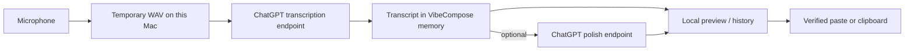

# VibeCompose

[简体中文](README.zh-CN.md)

**Open-source voice-first writing for macOS.** Press `F5`, speak, and turn the
result into a transcript, reply, email, bug report, or another structured
format with declarative Skills.

> [!IMPORTANT]
> VibeCompose is an independent, unofficial community project. It is not
> affiliated with, sponsored by, or endorsed by OpenAI. The current Alpha uses
> undocumented ChatGPT web endpoints after you sign in with your own ChatGPT
> account. Those endpoints can change or stop working without notice.

## Public Alpha Scope

The first public release intentionally has one provider path:

1. connect a ChatGPT account in the default browser;
2. record audio locally;
3. send the recording to ChatGPT for transcription;
4. optionally send the transcript and resolved Skill instructions to ChatGPT
   for polishing;
5. preview, paste, or copy the result.

There is no VibeCompose account or VibeCompose-operated transcription server.
Provider selection and API-key setup are not part of the first-release UI.

## Features

- Native AppKit + SwiftUI menu bar app for macOS 13+
- One-key start/stop dictation with configurable shortcuts (`F5` by default)
- Browser OAuth login with session storage in macOS Keychain
- Transcription, terminology alignment, optional AI Polish, and safe delivery
- 21 reviewed built-in Skills plus local declarative Community Skills
- Skill Switcher, editable Preview, redacted run receipts, and safe Undo
- Selected-text context with per-Skill permissions and sensitive-app blocking
- Writing Styles, personal terminology, and built-in Domain Packs
- Conservative paste verification with clipboard fallback
- Bounded local history, failed-recording recovery, and Delete All Data
- English and Simplified Chinese UI

Skills are instructions, not executables: they cannot run shell commands,
access the filesystem, or initiate network requests.

## Requirements

- macOS 13 or later
- a ChatGPT account that can use the required upstream capabilities
- Xcode Command Line Tools for source builds
- Microphone permission
- Accessibility permission for automatic paste; without it, output remains in
  the clipboard

## One-command Build, Install, and Run

```bash
git clone https://github.com/forever-ivy/vibecompose.git
cd vibecompose
./scripts/build_and_run.sh
```

The script packages the app, installs it at `/Applications/VibeCompose.app`,
and launches the installed copy. For normal development checks:

```bash
./scripts/check.sh
```

If no Apple development identity is available:

```bash
VIBECOMPOSE_ALLOW_ADHOC_SIGNING=1 ./scripts/build_and_run.sh
```

Ad-hoc signatures are suitable for local development, but macOS may require
Microphone and Accessibility permissions to be granted again after rebuilding.
Always verify permissions against `/Applications/VibeCompose.app`, not
`dist/VibeCompose.app`.

## OAuth Login

1. Open **VibeCompose → Settings → General**.
2. Choose **Use Browser Login**.
3. Complete the OpenAI authorization page in the default browser.
4. The browser returns to a loopback callback on this Mac.
5. Confirm that Settings shows **ChatGPT — Ready**.

The login uses OAuth 2.0 Authorization Code with PKCE. VibeCompose stores the
resulting session in macOS Keychain under
`app.vibecompose.mac.ChatGPTSession`; it does not store account passwords.
See [ChatGPT OAuth](docs/engineering/chatgpt-oauth.md).

## Privacy Data Flow



- Audio processing is remote: recorded audio is sent directly from the app to
  ChatGPT over HTTPS.
- Successful temporary recordings are deleted after processing. Failed audio
  is retained only when Recovery is enabled, with bounded retention.
- AI Polish may send the transcript, resolved Skill prompt, terminology,
  assigned Writing Style summary, and explicitly authorized selected text.
- ChatGPT tokens stay in Keychain. VibeCompose does not operate an intermediary
  account, analytics, synchronization, or transcription service.
- Local product metrics are off by default and are never uploaded
  automatically.

Read the complete [privacy data flow](docs/engineering/privacy-data-flow.md)
and [Privacy Policy](docs/legal/privacy-policy.md).

## Runtime Data

Application data is stored under:

```text
~/Library/Application Support/VibeCompose/
```

| Data | Default |
| --- | --- |
| Transcript history | On · 30 days / 500 records |
| Raw ASR text | Off |
| Successful recordings | Deleted after processing |
| Failed recordings | On for Retry · 24 hours / 10 records |
| Local diagnostics | On · 14 days / 1,000 records |
| Local product metrics | Off |

Use **Settings → Context & Privacy → Delete All Data** to remove local app
data and the saved ChatGPT session.

## Contributing

Issues, bug reproductions, documentation, translations, Skills, tests, and
code contributions are welcome.

```bash
git checkout -b fix/short-description
./scripts/check.sh
```

Do not include ChatGPT tokens, cookies, recordings, transcripts, private
documents, or raw crash reports in issues or pull requests. Read
[CONTRIBUTING.md](CONTRIBUTING.md), the
[Community Skill contribution guide](docs/engineering/community-skill-contribution-guide.md),
and [SECURITY.md](SECURITY.md) before submitting sensitive reports.

## Repository Layout

```text
Sources/VibeCompose/          macOS application source
Tests/VibeComposeTests/       unit and integration tests
scripts/                      build, package, install, and acceptance tools
website/                      static project site and Skill catalog
examples/skills/              Community Skill template
docs/                         product, engineering, privacy, and release docs
```

## Documentation

- [Documentation index](docs/README.md)
- [Architecture](docs/engineering/architecture.md)
- [ChatGPT OAuth](docs/engineering/chatgpt-oauth.md)
- [Privacy data flow](docs/engineering/privacy-data-flow.md)
- [Skill Runtime](docs/engineering/skill-runtime.md)
- [Release process](docs/engineering/release.md)
- [Privacy Policy](docs/legal/privacy-policy.md)
- [Terms of Use](docs/legal/terms-of-use.md)

## License

MIT. See [LICENSE](LICENSE).

PermissionFlow, Sparkle, and their bundled components retain their own
licenses. Notices are available in
[`Sources/VibeCompose/Resources/Legal`](Sources/VibeCompose/Resources/Legal).
