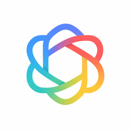
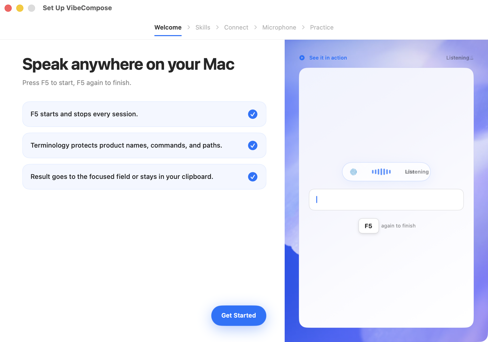
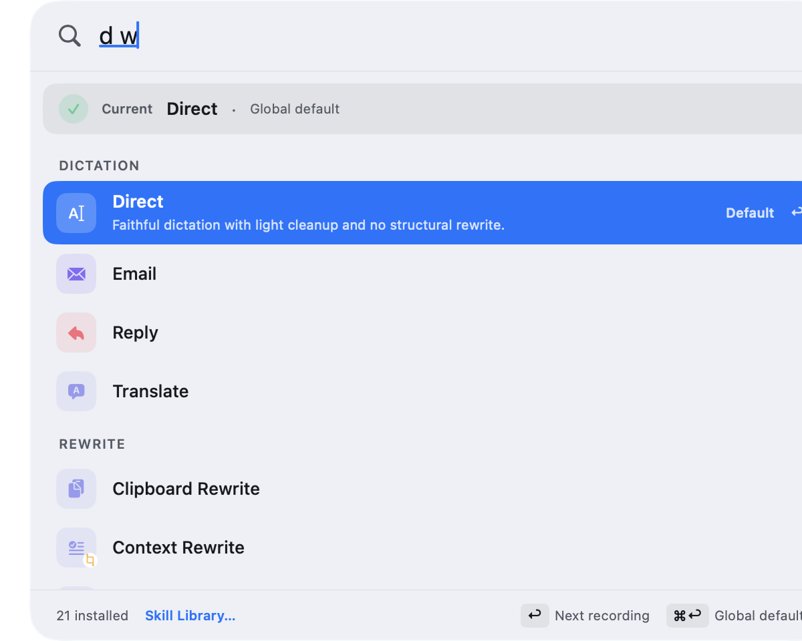
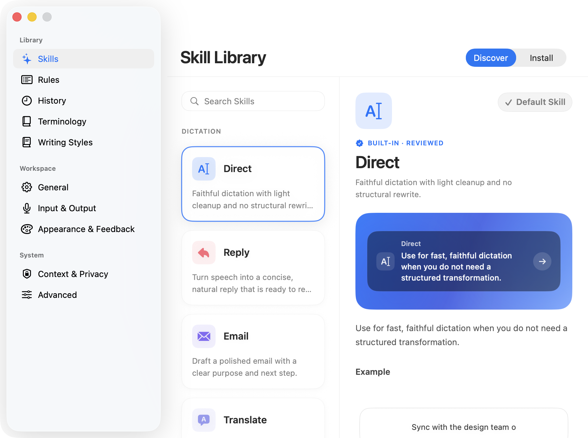
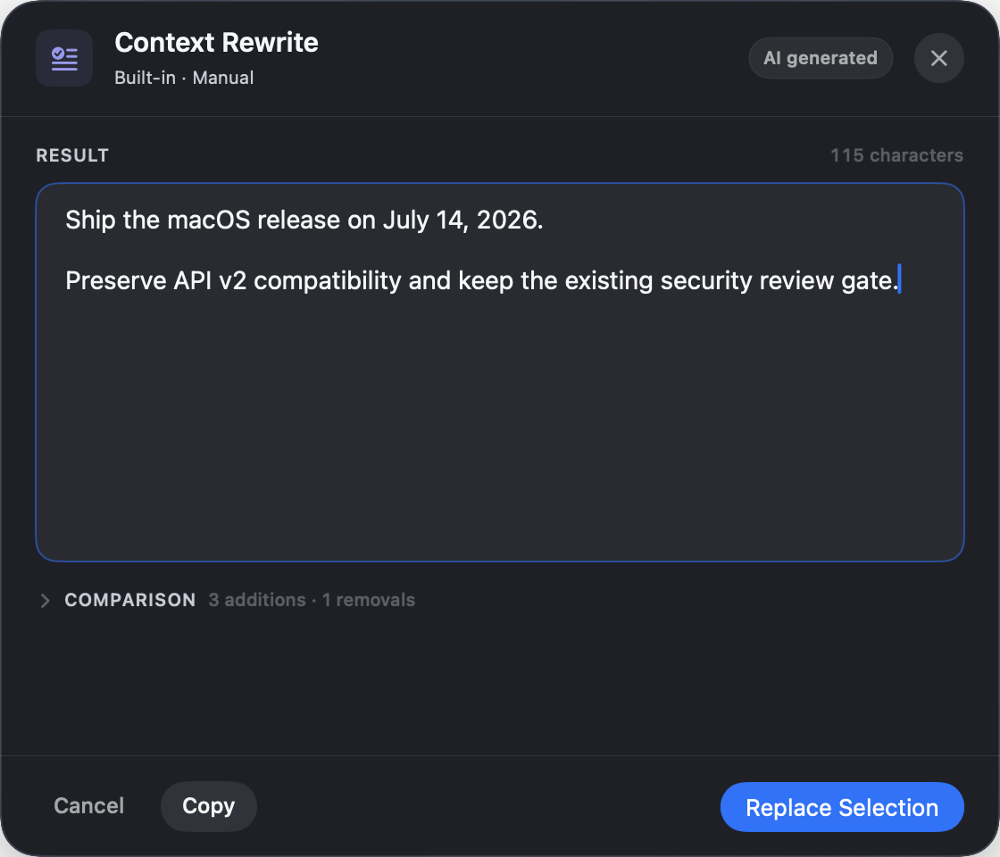
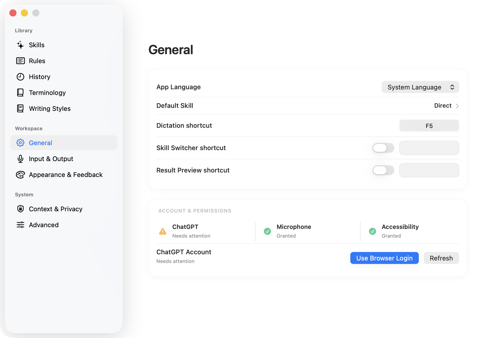

# VibeCompose

<p align="center">
  
</p>

[简体中文](README.zh-CN.md)


**Open-source voice-first writing for macOS.** Press `F5`, speak, and turn the
result into a transcript, reply, email, bug report, or another structured format
with declarative Skills — then get the result pasted back into the app you were
using, only after it is proven safe.

> [!IMPORTANT]
> VibeCompose is an independent, unofficial community project. It is not
> affiliated with, sponsored by, or endorsed by OpenAI. The current Alpha uses
> undocumented ChatGPT web endpoints after you sign in with your own ChatGPT
> account. Those endpoints can change or stop working without notice.

> [!NOTE]
> **Windows / Linux (beta):** a cross-platform implementation (Tauri v2 =
> Rust core + TypeScript UI, native Fluent / Adwaita look) lives in
> [`vibecompose-next/`](vibecompose-next/README.md). It ports this app's
> behavior contract — same Skill packages, same config schema, same trust
> boundary — while macOS keeps shipping from this Swift package.

## Contents

- [1. Introduction](#1-introduction)
- [2. Highlights](#2-highlights)
- [3. Use Cases](#3-use-cases)
- [4. Installation and Quick Start](#4-installation-and-quick-start)
- [5. How to Use Key Features](#5-how-to-use-key-features)
- [6. Configuration](#6-configuration)
- [7. Open Source Notice](#7-open-source-notice)
- [8. FAQ](#8-faq)
- [9. Contributing](#9-contributing)
- [10. License](#10-license)
- [11. Acknowledgements](#11-acknowledgements)

## 1. Introduction

VibeCompose is a native macOS menu bar app (AppKit + SwiftUI) for people who
want a private, repeatable voice-input workflow for writing:

```text
focus an editable target
→ the configured shortcut starts recording (default F5)
→ the same shortcut stops recording
→ transcribe (ChatGPT)
→ normalize terminology
→ optionally polish
→ re-check the current target
→ paste when proven safe, otherwise copy
```



*Press `F5` to start, speak, then press `F5` again to finish. VibeCompose sends
the result to the focused field when safe, or keeps it in the clipboard.*

The Public Alpha intentionally ships one provider path:

1. connect your own ChatGPT account in the default browser;
2. record audio locally;
3. send the recording to ChatGPT for transcription;
4. optionally send the transcript and resolved Skill instructions to ChatGPT
   for polishing;
5. preview, paste, or copy the result.

There is no VibeCompose account or VibeCompose-operated transcription server,
analytics, or synchronization service. Provider selection and API-key setup are
not part of the first-release UI.

## 2. Highlights

- **One-key workflow**: one configurable shortcut starts and stops dictation
  (default `F5`); `Esc` cancels at any time. Native AppKit + SwiftUI menu bar
  app for macOS 13+.
- **13 built-in Skills**: transcription, replies, email, translation, code
  prompts, bug reports, commit messages, meeting action items, and more — all
  versioned declarations with local validation. You can also import local
  declarative Community Skills. Skills are instructions, not executables: they
  cannot run shell commands, access the filesystem, or initiate network
  requests.
- **Selected-text context**: per-Skill grants (Ask / Always / Never),
  sensitive-app blocking, local Diff Preview, and replacement only after
  verifying the target, selection range, and text digest — any change falls
  back to the clipboard.
- **Writing Styles and terminology**: five built-in Writing Styles plus custom
  styles you create and assign per Skill; personal terminology and three
  built-in Domain Packs (Backend Engineering, Medical, Kubernetes) with
  conflict visibility and mandatory Preview for high-risk packs.
- **Conservative delivery**: outcomes are explicitly *inserted and verified*,
  *paste sent*, or *clipboard only* — with one-click Undo for the last
  verified insertion.
- **Privacy-first design**: sessions live in macOS Keychain; successful
  recordings are deleted after processing; history, recovery, and diagnostics
  are time- and count-bounded; local product metrics are off by default and
  never uploaded automatically; one-click Delete All Data.
- **A complete Skill ecosystem UI**: global Skill Switcher, Skill Library
  (Installed / Discover / Created), editable Preview, redacted run receipts,
  Creator, and Test Bench.
- **Bilingual UI**: English and Simplified Chinese, with localized Settings
  and Onboarding.

## 3. Use Cases

- **Faster everyday writing**: dictate emails, notes, and chat replies without
  leaving the app you are working in.
- **Developer workflows**: turn spoken repro steps into a structured bug
  report, spoken change notes into a commit message, or a spoken requirement
  into a Backend Prompt with goal, constraints, and acceptance criteria.
- **Meetings and collaboration**: turn spoken meeting content into decisions,
  action items, and open questions.
- **Cross-language communication**: dictate and translate in one pass, or
  rewrite / reply to selected text.
- **Domain-specific writing**: enable Domain Packs to align backend
  engineering, medical, or Kubernetes terminology with your personal
  dictionary.
- **Zero-setup users**: no API key or local model required — use the ChatGPT
  account you already have.

## 4. Installation and Quick Start

### Requirements

- macOS 13 or later
- a ChatGPT account that can use the required upstream capabilities
- Xcode Command Line Tools for source builds
- Microphone permission
- Accessibility permission for automatic paste; without it, output remains in
  the clipboard

### Download a prebuilt package

**Not provided.** The current Alpha is not Developer ID notarized, so there is
no publicly distributed installer (and no Homebrew Cask). Build from source
instead, as described below.

### One-command build, install, and run from source

```bash
git clone https://github.com/forever-ivy/vibecompose.git
cd vibecompose
./scripts/build_and_run.sh
```

The script packages the app, installs it at `/Applications/VibeCompose.app`,
and launches the installed copy. For normal development checks:

```bash
./scripts/check.sh
```

If no Apple development identity is available:

```bash
VIBECOMPOSE_ALLOW_ADHOC_SIGNING=1 ./scripts/build_and_run.sh
```

Ad-hoc signatures are suitable for local development, but macOS may require
Microphone and Accessibility permissions to be granted again after rebuilding.
Always verify permissions against `/Applications/VibeCompose.app`, not
`dist/VibeCompose.app`.

### First launch and login

The first launch walks you through five Onboarding steps:

1. **Welcome**: introduces the `F5 → speak → F5 → paste-or-copy` workflow;
2. **Skills**: explains how the active Skill shapes the result and how
   per-app rules can choose a Skill automatically;
3. **Connect**: choose **Use Browser Login** and complete the OpenAI
   authorization page in the default browser; the browser returns to a
   loopback callback on this Mac;
4. **Microphone**: grant Microphone permission as guided;
5. **Practice**: complete a practice dictation with your current shortcut.

Confirm that Settings shows **ChatGPT — Ready** and you are set. The login
uses OAuth 2.0 Authorization Code with PKCE. VibeCompose stores the resulting
session in macOS Keychain under `app.vibecompose.mac.ChatGPTSession`; it does
not store account passwords. See
[ChatGPT OAuth](docs/engineering/chatgpt-oauth.md).

## 5. How to Use Key Features

### Experience tour with annotated screenshots

The Onboarding screenshot in the Introduction shows the first-run flow, the
`F5` start/stop interaction, and the Refined HUD. The screens below cover the
next actions a new user is most likely to need.

#### Choose a Skill for the next dictation



Search or browse the installed Skills, then press `Return` to use one for the
next recording or `⌘↩` to make it the global default.

#### Browse the Skill Library



The Discover view explains each built-in Skill with a concrete example. Open
**Install** to import and manage Community Skills.

#### Review before replacing selected text



Preview lets you edit the final result, expand the Diff, copy it, or replace
the original selection only after VibeCompose re-validates the target.

#### Configure VibeCompose



Settings keeps the default Skill, shortcuts, account and permission state,
input/output behavior, appearance, privacy, and advanced options in one native
window. Changes persist immediately.

### 5.1 Everyday dictation and the shortcut

1. Focus an editable text field in any app;
2. Press `F5` (or your custom shortcut) to start recording — the HUD shows a
   timer;
3. Press the same shortcut again to stop; the transcript is pasted
   automatically (when verified safe) or kept in the clipboard;
4. Press `Esc` at any time to cancel; on failure, retry from the HUD or the
   menu bar **Retry last dictation** item;
5. If a paste went wrong, use **Undo Last Verified Insertion** in the menu to
   revert it.

To customize the shortcut: open **Settings… (⌘,) → Dictation** and press the
new combination in the shortcut recorder. VibeCompose rejects `Esc`, the fixed
Quick Add binding (⌃⌥Space), common macOS and editing combinations, and
bindings already taken. Changes are atomic — if registration or persistence
fails, the previous binding stays active, and **Restore F5** resets to the
default.

### 5.2 Built-in Skills: pick a task for each dictation

The 13 built-in Skills (version `1.1.0`) cover common writing tasks:

| Skill | Stable ID | Output / delivery | Notes |
| --- | --- | --- | --- |
| Direct | `app.vibecompose.skill.direct` | Plain text / automatic when verified / low | Instant transcription with protected technical literals |
| Reply | `app.vibecompose.skill.reply` | Plain text / automatic when verified / low | Conversational replies, up to 4,000 characters |
| Email | `app.vibecompose.skill.email` | Plain text / Preview / medium | Email drafts, up to 8,000 characters |
| Backend Prompt | `app.vibecompose.skill.agent-plan` | Markdown / Preview / medium | Structured prompt with Goal, Constraints, Implementation Steps, Edge Cases, Acceptance Criteria |
| Code Prompt | `app.vibecompose.skill.code-prompt` | Markdown / Preview / medium | Code prompts with closed-fence validation |
| Translate | `app.vibecompose.skill.translate` | Plain text / Preview / medium | Translation with protected technical literals |
| Context Rewrite | `app.vibecompose.skill.context-rewrite` | Plain text / Preview / medium | **Requires selected text**; rewrites it per your spoken instruction |
| Context Reply | `app.vibecompose.skill.context-reply` | Plain text / Preview / medium | **Requires selected text**; replies to it, up to 5,000 characters |
| Bug Report | `app.vibecompose.skill.bug-report` | Markdown / Preview / medium | Six required report sections, up to 8,000 characters |
| Commit Message | `app.vibecompose.skill.commit-message` | Plain text / Preview / medium | Commit messages, up to 1,000 characters |
| Meeting Action Items | `app.vibecompose.skill.meeting-action-items` | Markdown / Preview / medium | Decisions, Action Items, Open Questions; up to 8,000 characters |
| Product Brief | `app.vibecompose.skill.product-brief` | Markdown / Preview / medium | Seven required brief sections, up to 8,000 characters |
| Customer Support Reply | `app.vibecompose.skill.customer-support-reply` | Plain text / Preview / medium | Support replies up to 5,000 characters with forbidden unsupported-guarantee phrases |

**How to use them:**

- **One-off switch**: use **Current Skill → Search and Choose…** in the menu
  bar, or the global Skill Switcher — this affects only the current dictation;
- **Set a default**: **Current Skill → Set as Global Default**;
- **Per-app automation**: configure a default Skill in Settings and add exact
  bundle-identifier rules for specific apps (an installed-application picker
  is included). Resolution order: manual selection for the current invocation
  → app rule → global default → built-in Direct fallback. The Skill freezes
  when recording starts, so switching apps mid-recording cannot change the
  session. Settings warns explicitly when a non-Direct Skill cannot run
  because AI Polish is off or ChatGPT is not connected.

### 5.3 Selected-text context: rewrite or reply to what you selected

1. Open **Settings → Context & Privacy**, enable selected-text context, and
   set a character budget (2,000 / 6,000 / 12,000);
2. For Skills that declare the `selection` capability (Context Rewrite,
   Context Reply, and any Community Skill that declares it), choose
   **Ask every time**, **Always allow**, or **Never allow**; built-in and
   user-configured sensitive apps are denied before capture;
3. Select text in any app and dictate with one of those Skills; the selected
   text is read only after **Allow Once** or a persistent grant (choose
   **Voice Only** to skip reading it);
4. When finished, Preview shows the Diff against the original — choose
   **Replace Selection** (executed only if the original target, selection
   range, and text SHA-256 are all unchanged) or copy. If the selection
   changed while you spoke, VibeCompose will not overwrite it and reports
   **Copied — selection changed**.

### 5.4 Community Skills: import and write your own

**Import a local Skill package:**

```bash
cp -R \
  examples/skills/IssueDraft.vibecomposeskill \
  /tmp/MyIssueDraft.vibecomposeskill
```

Edit its ID, version, name, prompt, validators, and terminology, then open
**Settings → AI Polish → Local Community Skills → Import Skill…**, choose the
`.vibecomposeskill` directory, review the declared permissions, files, output
policy, and SHA-256, and install it.

**Manage installed Skills**: install multiple semantic versions, switch the
**Active Version** to roll back, disable a Skill without deleting it, or
uninstall one version. The Skill Inspector shows permissions, output policy,
validators, reviewed files, and a content SHA-256. Golden contract tests run
deterministic local checks on the package — they never call a provider.

**Write your own Skill**: a package is a directory containing required
`skill.yaml` and `prompt.md`, plus optional `terminology.csv`,
`validators.json`, `examples.jsonl`, `localizations/`, and
`tests/golden.jsonl`. Hard limits apply (up to 64 files, 256 KiB per file,
1 MiB per package), and content is declarative only — executables, scripts,
and symlinks are rejected. See the full
[Community Skill SDK](docs/engineering/community-skill-sdk.md).

**Use AI to draft a Skill:** if you do not want to start from blank files, copy
the Prompt below into ChatGPT and replace the bracketed placeholders:

```text
You are a VibeCompose Community Skill designer. Based on my requirements,
generate a declarative Skill draft that can be imported into VibeCompose.

My requirements:
- Skill name: [for example, Technical Plan]
- Use case: [when I will use it]
- Input: [what I usually dictate]
- Desired output: [the format I want]
- Tone and terminology: [for example, concise and professional; preserve
  English technical terms]

Output the complete contents of these files, using each filename as a heading:
1. `skill.yaml`
2. `prompt.md`
3. `validators.json` (only if needed)
4. `examples.jsonl` (at least two normal cases and one boundary case)
5. `terminology.csv` (only if fixed terms are needed)

Requirements:
- Use the Community Skill v1 format, with a unique reverse-domain ID and a
  semantic version;
- Declare only the voice, selection, and styleCapsule permissions required;
- Specify the output format, delivery policy, risk level, required sections,
  and maximum length;
- In `prompt.md`, define technical literals to preserve, content not to invent,
  and boundary cases;
- Use declarative text only: no scripts, Shell, tool calls, MCP, network
  requests, credentials, hidden instructions, or filesystem operations;
- Do not use real personal data, and keep all YAML, JSON, JSONL, CSV, and
  Markdown syntax valid;
- End with a pre-install checklist and identify every field I must review.
```

Save the generated files in one `.vibecomposeskill` directory, review its
permissions, output policy, and contents, then import it through
**Settings → AI Polish → Local Community Skills → Import Skill…**. AI output is
a draft; it does not replace local validation or human review.

### 5.5 Writing Styles: make output sound like you

- Use the five built-in Writing Styles from the Style Capsule section in
  Settings, or create your own by pasting sample text (analyzed locally; the
  source sample is not kept by default);
- Assign a style per Skill; the resolved style summary freezes at recording
  start;
- Custom styles support editing, export, and deletion.

### 5.6 Terminology and Domain Packs: get proper nouns right

- Open **Terminology…** from the menu bar to search, sort, edit, enable or
  disable, and delete entries; CSV import/export with conflict preview is
  supported;
- Press **⌃⌥Space** anywhere to open the Quick Add panel and add a term you
  just heard, without breaking your flow;
- Enable built-in Domain Packs in Settings: Backend Engineering, Medical, and
  Kubernetes; conflicts between user terms and packs are visible, and
  high-risk packs such as Medical force Preview;
- Runtime precedence: user explicit correction > Skill-local terminology >
  user normal terminology > enabled Domain Pack > ASR hints / original result.

### 5.7 History, recovery, and deleting data

- **History…** in the menu bar: filter, view details, copy or retry, audio
  actions, and delete individual records;
- Failed dictations are retained with bounds (default 24 hours / 10 records)
  for Recovery Retry; retry results are copy-only by default;
- **Settings → Context & Privacy → Delete All Data** removes local app data
  and the saved ChatGPT session, then rebuilds a default configuration.

### 5.8 Feedback modes and appearance

Open **Settings → Appearance & Feedback** to switch between three modes — you
can preview each without reading audio, history, or user text:

- **Refined HUD** (default): a compact capsule at the top center of the active
  display covering recording, processing, completion, and error states;
- **AI Activity Glow**: an ambient glow around the active display or focused
  window — green pulse on success, amber on clipboard fallback, red double
  pulse on error — with compact text so states are not distinguished by color
  alone;
- **Hidden**: no visible feedback surface; menu state, optional sounds and
  notifications remain, and `Esc` cancellation still works.

You can also configure intensity, the Glow frame target, feedback sounds,
completion notifications, and an always-reduce-motion override.

## 6. Configuration

Application data is stored under:

```text
~/Library/Application Support/VibeCompose/
```

Local data defaults:

| Data | Default |
| --- | --- |
| Transcript history | On · 30 days / 500 records |
| Raw ASR text | Off |
| Successful recordings | Deleted after processing |
| Failed recordings | On for Retry · 24 hours / 10 records |
| Local diagnostics | On · 14 days / 1,000 records |
| Local product metrics | Off; never uploaded automatically |

- The main configuration file is `config.json`; changes persist immediately;
- Known password managers, Keychain, and Passwords are excluded from
  transcript/recovery persistence; you can add your own sensitive bundle
  identifiers in configuration;
- Support diagnostics can be exported as a local, owner-only, redacted ZIP —
  never uploaded automatically — for voluntary sharing when troubleshooting.

For the complete privacy story, read the
[privacy data flow](docs/engineering/privacy-data-flow.md) and
[Privacy Policy](docs/legal/privacy-policy.md).

## 7. Open Source Notice

- **Completely free and open source**: no subscription, no paid features, and
  no VibeCompose account system; transcription and polish run through your own
  ChatGPT account.
- **Independent community project**: not affiliated with, sponsored by, or
  endorsed by OpenAI.
- **Honest Alpha caveats**:
  - This Alpha is not Developer ID notarized and is not a signed production
    release;
  - the default ChatGPT route depends on undocumented upstream behavior and is
    not a stable public API (see the
    [upstream incident playbook](docs/support/upstream-incident-playbook.md));
  - the name `VibeCompose` has not completed trademark, domain, or other
    public-launch clearance, so public distribution channels (update feed,
    Homebrew) are **not provided**;
  - public support channels are not established yet; see the
    [Support Policy](docs/support/support-policy.md).
- **Third-party components**: PermissionFlow, Sparkle, and their bundled
  components retain their own licenses. Notices are available in
  [`Sources/VibeCompose/Resources/Legal`](Sources/VibeCompose/Resources/Legal).

## 8. FAQ

**Does VibeCompose cost anything?**
No. It is MIT-licensed open source with no subscription or paid features. You
need your own ChatGPT account for transcription and polish; upstream
availability depends on your account.

**Does it work offline?**
No. Audio is sent directly to ChatGPT over HTTPS. AI Polish may send the
transcript, resolved Skill prompt, terminology, assigned Writing Style
summary, and explicitly authorized selected text to ChatGPT.

**Can it paste into any app?**
VibeCompose sends Cmd+V only when it can verify the current editable target,
and it distinguishes *inserted and verified*, *paste sent*, and *clipboard
only* outcomes. When verification is not possible, the result stays in the
clipboard — it never pastes blindly.

**When does AI Polish trigger?**
In Auto mode it skips short, low-complexity Direct dictation, and runs for
corrections, structure, translation, email, or long-form intent. Diagnostics
record only a bounded decision reason, not the text.

**Are Skills safe?**
Built-in and Community Skills are declarative instructions: they cannot
execute code, access the filesystem, make network requests, read the Keychain,
or change the provider. Community packages go through permission review, file
inspection, and SHA-256 verification before installation.

**Are Intel Macs supported?**
**Not provided.** The repository does not declare an architecture restriction;
building from source works on any Mac meeting the requirements. Public
installer builds are not provided at this stage.

**Can I switch providers or use an API key?**
The first release ships a single ChatGPT OAuth path; provider selection and
API-key configuration are not part of the UI.

**How do I delete my data?**
Use **Settings → Context & Privacy → Delete All Data** to remove local app
data and the saved ChatGPT session. For data already processed or retained by
ChatGPT, use your ChatGPT account controls.

## 9. Contributing

Issues, bug reproductions, documentation, translations, Skills, tests, and
code contributions are welcome.

```bash
git checkout -b fix/short-description
./scripts/check.sh
```

- Commit messages follow [Conventional Commits](CONTRIBUTING.md#git-commit-messages);
- do not include ChatGPT tokens, cookies, recordings, transcripts, private
  documents, or raw crash reports in issues or pull requests;
- to write a Skill, start from the [`examples/skills/`](examples/skills/)
  template and read the
  [Community Skill contribution guide](docs/engineering/community-skill-contribution-guide.md);
- report vulnerabilities through [SECURITY.md](SECURITY.md), not a public
  issue.

Read [CONTRIBUTING.md](CONTRIBUTING.md) for the full workflow.

## 10. License

MIT. See [LICENSE](LICENSE).

PermissionFlow, Sparkle, and their bundled components retain their own
licenses. Notices are available in
[`Sources/VibeCompose/Resources/Legal`](Sources/VibeCompose/Resources/Legal).

## 11. Acknowledgements

Thanks to the [linuxdo](https://linux.do/) community for discussion, sharing,
and feedback.
