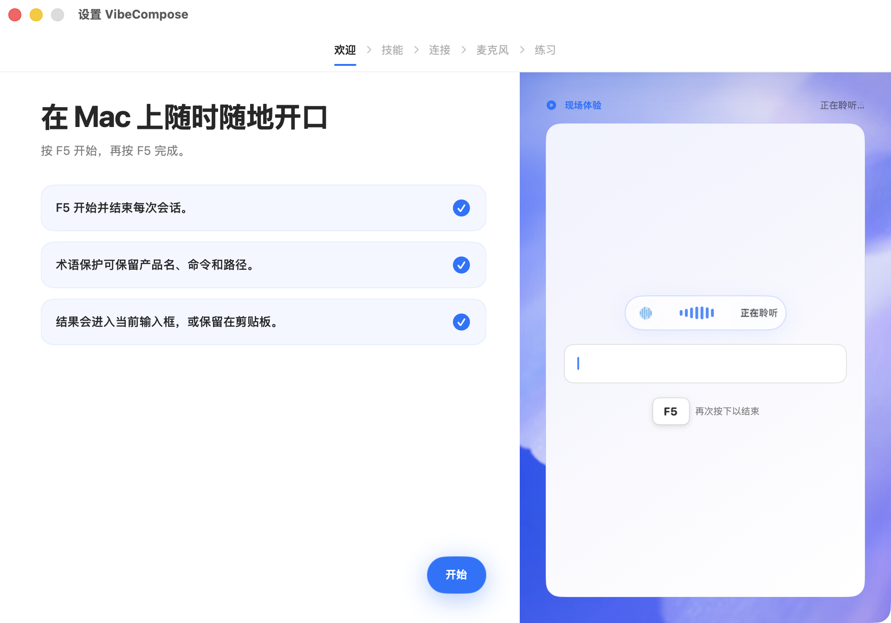
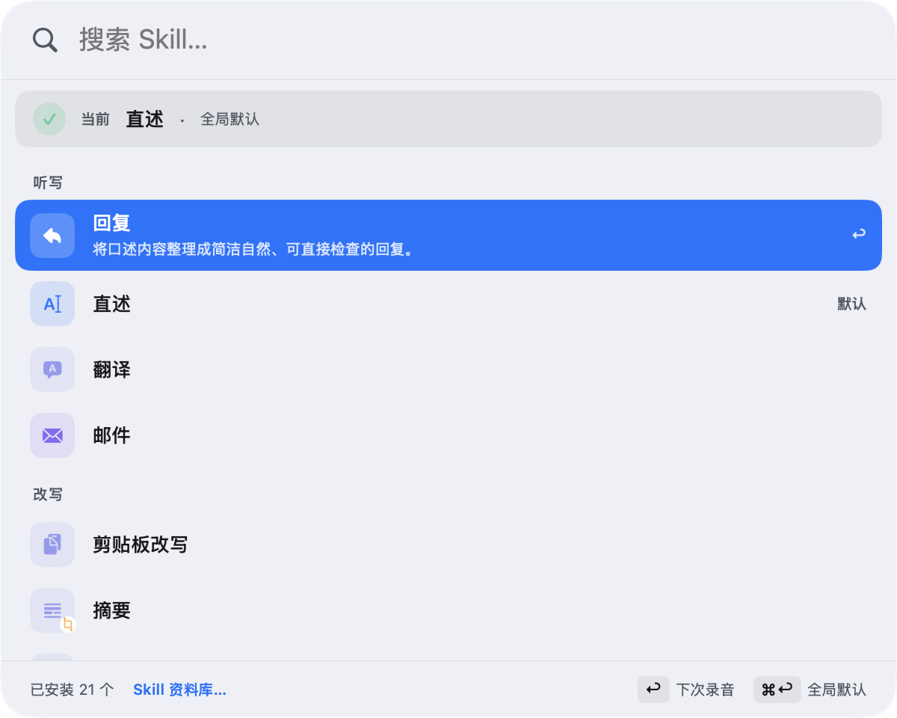
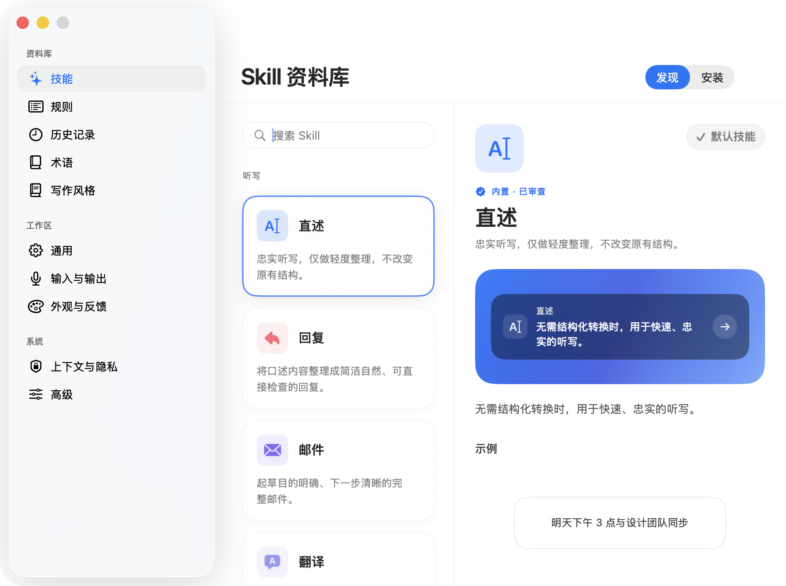
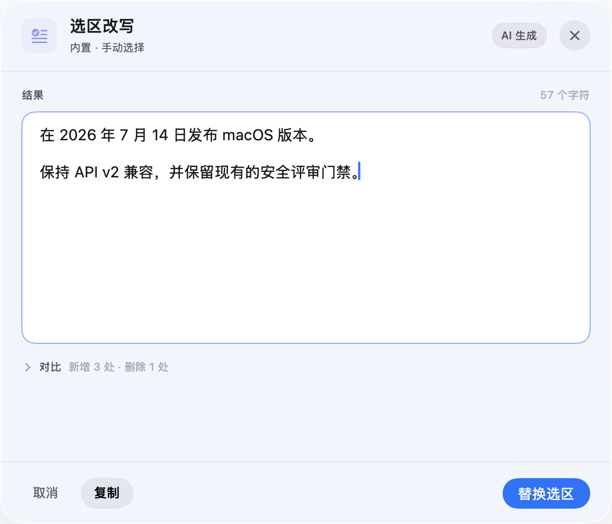
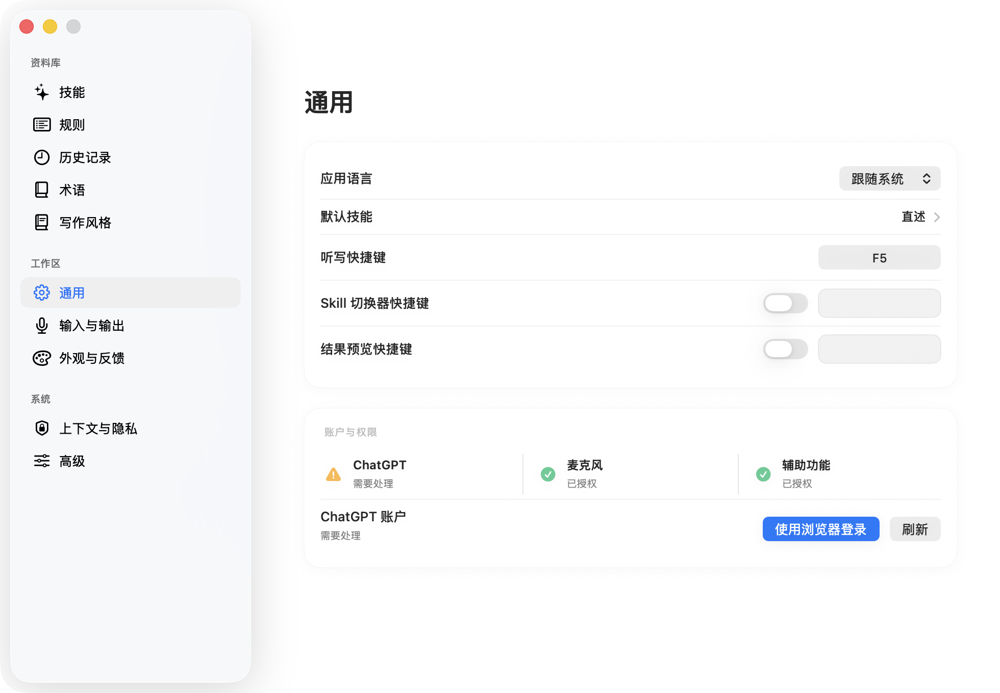

# VibeCompose

<p align="center">
  
</p>

[English](README.md)


**面向 macOS 的开源语音写作工具。**按下 `F5` 开始口述，再按一次结束；
声明式 Skill 会把语音变成转写、回复、邮件、Bug 报告或其他结构化文本，
并在验证安全后粘贴回你正在使用的应用。

> [!IMPORTANT]
> VibeCompose 是独立、非官方的社区项目，与 OpenAI 不存在隶属、赞助或官方
> 背书关系。当前 Alpha 在你使用自己的 ChatGPT 账户登录后，依赖 ChatGPT 未
> 公开的网页端接口。这些接口可能随时变化或停止工作。

## 目录

- [1. 项目简介](#1-项目简介)
- [2. 项目亮点](#2-项目亮点)
- [3. 适用场景](#3-适用场景)
- [4. 安装与快速开始](#4-安装与快速开始)
- [5. 特色功能使用方法](#5-特色功能使用方法)
- [6. 配置说明](#6-配置说明)
- [7. 开源说明](#7-开源说明)
- [8. 常见问题](#8-常见问题)
- [9. 贡献指南](#9-贡献指南)
- [10. 许可证](#10-许可证)
- [11. 致谢](#11-致谢)

## 1. 项目简介

VibeCompose 是一个常驻菜单栏的原生 macOS 应用（AppKit + SwiftUI），为
需要频繁写作的人提供一条私密的、可重复的语音输入工作流：

```text
聚焦可编辑目标
→ 按快捷键开始录音（默认 F5）
→ 再按一次结束录音
→ 转写（ChatGPT）
→ 术语对齐
→ 可选 AI Polish
→ 重新校验当前目标
→ 验证安全后粘贴，否则保留在剪贴板
```



*按 `F5` 开始口述，说完后再次按 `F5`；验证安全时结果会进入当前输入框，
否则会保留在剪贴板。*

首个公开版本（Public Alpha）只提供一条 Provider 路径：

1. 在默认浏览器连接你自己的 ChatGPT 账户；
2. 在本机录制音频；
3. 把录音发送到 ChatGPT 转写；
4. 可选地把转写和解析后的 Skill 指令发送到 ChatGPT 润色；
5. 预览、粘贴或复制结果。

VibeCompose 不提供自有账户体系，也不运营转写服务器、分析或同步服务。
首版界面不提供 Provider 选择或 API Key 配置。

## 2. 项目亮点

- **一键工作流**：单快捷键开始/停止听写（默认 `F5`，可自定义），`Esc` 随时
  取消；原生 AppKit + SwiftUI 菜单栏应用，支持 macOS 13+。
- **13 个内置 Skill**：转写、回复、邮件、翻译、代码提示、Bug 报告、Commit
  Message、会议纪要等，全部经过版本化声明与本地校验；还支持导入本地声明式
  Community Skill。Skill 是指令，不是可执行程序——它们不能运行 Shell、访问
  文件系统或自行发起网络请求。
- **选中文本上下文**：按 Skill 授权（每次询问 / 总是允许 / 从不允许）、敏感
  应用拦截、本地 Diff Preview，并在替换前逐项验证目标、选区与文本摘要，任何
  一项变化都会退回剪贴板。
- **Writing Style 与术语体系**：5 个内置 Writing Style，可创建自己的风格并
  按 Skill 分配；个人术语 + 三个内置 Domain Pack（后端工程、医学、
  Kubernetes），冲突可见，医学等高风险 Pack 强制 Preview。
- **保守的交付策略**：插入结果分为“已验证插入 / 已发送粘贴 / 仅剪贴板”三种
  明确状态，可一键 Undo 上一次已验证插入。
- **隐私优先设计**：会话保存在 macOS Keychain；成功录音处理后即删；历史、
  Recovery、诊断均有时间/条数上限；本地产品指标默认关闭且不会自动上传；
  一键“删除全部数据”。
- **完整的 Skill 生态界面**：全局 Skill Switcher、Skill Library
  （Installed / Discover / Created）、可编辑 Preview、脱敏运行回执、
  Creator 与 Test Bench。
- **双语界面**：英文与简体中文 UI，设置与引导均已本地化。

## 3. 适用场景

- **日常写作提速**：口述邮件、笔记、聊天回复，不打断当前工作窗口。
- **开发者工作流**：口述复现步骤生成结构化 Bug 报告；口述改动说明生成
  Commit Message；口述需求生成带目标、约束与验收标准的 Backend Prompt。
- **会议与协作**：口述会议内容生成决议、行动项与待决问题清单。
- **跨语言沟通**：口述即翻译，或对选中文本进行改写 / 回复。
- **专业领域写作**：启用 Domain Pack 对齐后端工程、医学或 Kubernetes 术语，
  结合个人术语表保持用词一致。
- **不想折腾模型与密钥的用户**：不需要 API Key 或本地模型，使用已有的
  ChatGPT 账户即可开始。

## 4. 安装与快速开始

### 环境要求

- macOS 13 或更高版本
- 能使用所需上游能力的 ChatGPT 账户
- 源码构建需要 Xcode Command Line Tools
- 麦克风权限
- 自动粘贴需要辅助功能权限；未授权时结果保留在剪贴板

### 下载预编译安装包

**未提供。**当前 Alpha 尚未进行 Developer ID 公证，暂不提供公开下载的安装
包（Homebrew Cask 同样**未提供**）。请从源码构建，见下节。

### 从源码一键构建、安装并运行

```bash
git clone https://github.com/forever-ivy/vibecompose.git
cd vibecompose
./scripts/build_and_run.sh
```

该脚本会打包应用、安装到 `/Applications/VibeCompose.app`，并启动安装版。
日常开发检查使用：

```bash
./scripts/check.sh
```

本机没有 Apple 开发签名身份时：

```bash
VIBECOMPOSE_ALLOW_ADHOC_SIGNING=1 ./scripts/build_and_run.sh
```

临时签名适合本地开发，但重新构建后 macOS 可能要求重新授权麦克风和辅助功能。
权限验证必须针对 `/Applications/VibeCompose.app`，不要把 `dist/VibeCompose.app`
当作实际运行实例。

### 首次启动与登录

首次启动会进入五步引导（Onboarding）：

1. **Welcome**：介绍 `F5 → 说话 → F5 → 粘贴或复制` 的核心工作流；
2. **Skills**：说明当前 Skill 如何决定输出形式，以及如何按应用自动选择 Skill；
3. **Connect**：点击 **使用浏览器登录**，在默认浏览器完成 OpenAI 授权，
   浏览器会回到本机回环地址回调；
4. **Microphone**：按引导授予麦克风权限；
5. **Practice**：用当前快捷键完成一次练习听写。

确认设置中显示 **ChatGPT — 已就绪** 后即可开始。登录采用 OAuth 2.0
Authorization Code + PKCE；VibeCompose 不保存账户密码，会话保存在 macOS
Keychain 的 `app.vibecompose.mac.ChatGPTSession`。详见
[ChatGPT OAuth](docs/engineering/chatgpt-oauth.md)。

## 5. 特色功能使用方法

### 使用体验导览与截图说明

项目简介中的欢迎页截图已经展示了首次启动流程、`F5` 开始/停止操作和 Refined
HUD。下面继续展示新用户最常用的四个界面。

#### 为下一次听写选择 Skill



搜索或浏览已安装的 Skill，按 `Return` 仅用于下一次录音，按 `⌘↩` 设为全局
默认。

#### 浏览 Skill 资料库



“发现”页用具体示例说明每个内置 Skill；进入“安装”可导入和管理 Community
Skill。

#### 替换选中文字前确认结果



Preview 中可以编辑最终结果、展开对比、复制文本，或在 VibeCompose 重新校验
目标后替换原选区。

#### 配置 VibeCompose



设置窗口集中管理默认 Skill、快捷键、账户与权限、输入输出、外观、隐私和高级
选项，修改后立即保存。

### 5.1 每日听写与快捷键

1. 在任意应用中聚焦一个可编辑文本框；
2. 按 `F5`（或你的自定义快捷键）开始录音，HUD 显示计时；
3. 说完后再按一次结束；转写完成后自动粘贴（验证安全时）或进入剪贴板；
4. 随时按 `Esc` 取消；失败时可通过 HUD 或菜单栏 **Retry last dictation** 重试；
5. 如果粘贴结果不理想，使用菜单栏 **Undo Last Verified Insertion** 撤销上一次
   已验证插入。

自定义快捷键：打开 **Settings…（⌘,）→ 听写**，在快捷键录制框中按下新组合。
系统会拒绝 `Esc`、固定的 Quick Add 组合（⌃⌥Space）、常见 macOS 与编辑组合键；
更换是原子操作——注册或保存失败时旧快捷键保持有效，**Restore F5** 可随时恢复
默认。

### 5.2 内置 Skill：为每次听写选择任务

13 个内置 Skill（版本 `1.1.0`）覆盖常见写作任务：

| Skill | 稳定 ID | 输出 / 交付 | 说明 |
| --- | --- | --- | --- |
| Direct | `app.vibecompose.skill.direct` | 纯文本 / 验证后自动粘贴 / 低 | 即时转写，保护口述技术字面量 |
| Reply | `app.vibecompose.skill.reply` | 纯文本 / 验证后自动 / 低 | 对话回复，最长 4,000 字 |
| Email | `app.vibecompose.skill.email` | 纯文本 / Preview / 中 | 邮件草稿，最长 8,000 字 |
| Backend Prompt | `app.vibecompose.skill.agent-plan` | Markdown / Preview / 中 | 生成含目标、约束、实现步骤、边界情况、验收标准的结构化提示 |
| Code Prompt | `app.vibecompose.skill.code-prompt` | Markdown / Preview / 中 | 代码提示，校验代码围栏闭合 |
| Translate | `app.vibecompose.skill.translate` | 纯文本 / Preview / 中 | 翻译，保护技术字面量 |
| Context Rewrite | `app.vibecompose.skill.context-rewrite` | 纯文本 / Preview / 中 | **需要选中文字**，按口述指令改写 |
| Context Reply | `app.vibecompose.skill.context-reply` | 纯文本 / Preview / 中 | **需要选中文字**，按口述指令回复，最长 5,000 字 |
| Bug Report | `app.vibecompose.skill.bug-report` | Markdown / Preview / 中 | 生成含六个必备章节的报告，最长 8,000 字 |
| Commit Message | `app.vibecompose.skill.commit-message` | 纯文本 / Preview / 中 | 生成提交信息，最长 1,000 字 |
| Meeting Action Items | `app.vibecompose.skill.meeting-action-items` | Markdown / Preview / 中 | 生成决议、行动项与待决问题，最长 8,000 字 |
| Product Brief | `app.vibecompose.skill.product-brief` | Markdown / Preview / 中 | 生成含七个必备章节的简报，最长 8,000 字 |
| Customer Support Reply | `app.vibecompose.skill.customer-support-reply` | 纯文本 / Preview / 中 | 生成客服回复，最长 5,000 字，禁用过度承诺短语 |

**如何使用：**

- **临时切换**：菜单栏 **当前 Skill → Search and Choose…**，或在全局 Skill
  Switcher 中选择，仅影响当前一次听写；
- **设为默认**：菜单栏 **当前 Skill → Set as Global Default**；
- **按应用自动切换**：在设置中配置默认 Skill，并为特定应用添加精确的
  Bundle Identifier 规则（设置内提供已安装应用选择器）。解析顺序为：本次手动
  选择 → 应用规则 → 全局默认 → Direct 兜底；录音开始时 Skill 即冻结，切换应用
  不会改变本次会话。当 AI Polish 关闭或 ChatGPT 未连接导致非 Direct Skill 无法
  运行时，设置中会明确提示。

### 5.3 选中文本上下文：改写或回复你选中的文字

1. 打开 **设置 → 上下文与隐私**，启用选中文本上下文，并设置字符上限
   （2,000 / 6,000 / 12,000）；
2. 为 Context Rewrite / Context Reply 等声明了 `selection` 能力的 Skill 选择
   **每次询问 / 总是允许 / 从不允许**；内置与用户自定义的敏感应用会在捕获前被
   直接拒绝；
3. 在应用中选中一段文字，使用上述 Skill 开始听写；选择 **Allow Once** 或授予
   持久权限后才会读取选中内容（选“Voice Only”则不读取）；
4. 完成后进入 Preview：可查看与原文的 Diff，选择 **Replace Selection**（仅在原
   目标、选区与文本 SHA-256 均未变化时执行）或复制。若选区在你口述期间被改
   动，VibeCompose 不会覆盖，结果显示 **Copied — selection changed**。

### 5.4 Community Skill：导入与编写自己的 Skill

**导入本地 Skill 包：**

```bash
cp -R \
  examples/skills/IssueDraft.vibecomposeskill \
  /tmp/MyIssueDraft.vibecomposeskill
```

编辑其中的 ID、版本、名称、Prompt、校验器与术语，然后打开
**设置 → AI Polish → Local Community Skills → Import Skill…**，选择
`.vibecomposeskill` 目录，检查声明的权限、文件清单、输出策略与 SHA-256 后安装。

**管理已安装 Skill**：多版本并存，可切换 **Active Version** 回滚；可停用（不
删除文件）或按版本卸载；Skill Inspector 展示权限、校验器、已审查文件与内容
哈希；Golden 合约测试在本地验证包的结构与字面量保持能力，不调用 Provider。

**编写自己的 Skill**：包为目录形式，必须包含 `skill.yaml` 与 `prompt.md`，可选
`terminology.csv`、`validators.json`、`examples.jsonl`、`localizations/` 与
`tests/golden.jsonl`。包有严格上限（最多 64 个文件、单文件 256 KiB、整包
1 MiB），且只允许声明式内容——任何可执行文件、脚本、符号链接都会被拒绝。
完整规范见 [Community Skill SDK](docs/engineering/community-skill-sdk.md)。

**用 AI 生成 Skill 草稿：**不想从零开始写文件时，可以把下面的 Prompt 复制给
ChatGPT，并替换方括号里的内容：

```text
你是 VibeCompose Community Skill 设计助手。请根据我的需求，生成一个可导入
VibeCompose 的声明式 Skill 草稿。

我的需求：
- Skill 名称：[例如：技术方案整理]
- 使用场景：[我什么时候会使用它]
- 输入内容：[我通常会口述什么]
- 期望输出：[希望得到什么格式的结果]
- 语气和术语：[例如：简洁、专业，保留英文技术名词]

请严格输出以下文件的完整内容，并使用对应文件名作为标题：
1. `skill.yaml`
2. `prompt.md`
3. `validators.json`（如果确实需要）
4. `examples.jsonl`（至少两个正常例子和一个边界例子）
5. `terminology.csv`（如果需求包含固定术语）

要求：
- 使用 Community Skill v1 格式，生成唯一的反向域名 ID 和语义化版本号；
- 只声明完成任务所需的 voice、selection、styleCapsule 权限；
- 明确输出格式、交付方式、风险等级、必需章节和最大长度；
- 在 prompt 中说明要保留的技术字面量、不能臆造的内容和边界情况；
- 只能使用声明式文本，不能包含脚本、Shell、工具调用、MCP、网络请求、凭据、
  文件系统操作或隐藏指令；
- 不要使用真实个人信息，并确保所有 JSON、JSONL、CSV 和 YAML 语法有效；
- 最后给出一份安装前检查清单，并指出哪些字段需要我人工确认。
```

把生成的文件保存到同一个 `.vibecomposeskill` 目录，检查权限、输出策略和内容后，
再通过 **设置 → AI Polish → Local Community Skills → Import Skill…** 导入。AI 生成
的结果只是草稿，不能跳过本地检查和人工审核。

### 5.5 Writing Style：让输出像你的风格

- 在设置的 Style Capsule 区域使用 5 个内置 Writing Style，或粘贴样例文本创建
  自己的风格（样例在本地分析，默认不保留源样例）；
- 按 Skill 分配风格，录音开始时冻结本次使用的风格摘要；
- 自定义风格支持编辑、导出与删除。

### 5.6 术语与 Domain Pack：保证专有名词写对

- 菜单栏 **Terminology…** 打开术语管理窗口：搜索、排序、编辑、启用/停用、
  删除，支持 CSV 导入/导出与导入冲突预览；
- 在任意位置按 **⌃⌥Space** 呼出 Quick Add 面板，立刻把刚听到的术语加入词表；
- 在设置中启用内置 Domain Pack：后端工程、医学、Kubernetes；用户术语与 Pack
  冲突可见，医学等高风险 Pack 会强制 Preview；
- 运行时优先级：用户显式纠正 > Skill 自带术语 > 用户普通术语 > 启用的
  Domain Pack > ASR 提示 / 原始结果。

### 5.7 历史、Recovery 与数据删除

- 菜单栏 **History…**：筛选、查看详情、复制或重试、处理音频、删除单条记录；
- 失败的听写会按上限保留（默认 24 小时 / 10 条）用于 Recovery Retry，重试结果
  仅复制到剪贴板；
- **设置 → 上下文与隐私 → 删除全部数据**：删除本地应用数据与已保存的 ChatGPT
  会话，并重建默认配置。

### 5.8 反馈模式与外观

打开 **设置 → 外观与反馈**，在三种模式中切换并可随时预览（不读取音频、历史或
用户文本）：

- **Refined HUD**（默认）：屏幕顶部中央的紧凑胶囊，完整展示录音、处理、完成
  与错误状态；
- **AI Activity Glow**：围绕当前屏幕或焦点窗口的环境光效，成功绿色脉冲、剪贴板
  兜底琥珀色、错误红色双脉冲，并配合文字提示，不依赖颜色单独区分状态；
- **Hidden**：不显示可视反馈，仅保留菜单状态、可选音效与通知，`Esc` 取消仍然
  有效。

同时可配置反馈强度、Glow 目标、提示音、完成通知与“始终减弱动态效果”。

## 6. 配置说明

应用数据位于：

```text
~/Library/Application Support/VibeCompose/
```

本地数据默认值：

| 数据 | 默认值 |
| --- | --- |
| 转写历史 | 开启 · 30 天 / 500 条 |
| 原始 ASR 文本 | 关闭 |
| 成功录音 | 处理后删除 |
| 失败录音 | 为 Retry 保留 · 24 小时 / 10 条 |
| 本地诊断 | 开启 · 14 天 / 1,000 条 |
| 本地产品指标 | 关闭，不会自动上传 |

- 主配置文件为 `config.json`，修改即时保存；
- 已知密码管理器、Keychain 与 Passwords 默认排除在转写/Recovery 持久化之外；
  可在配置中追加自定义敏感应用 Bundle Identifier；
- 支持诊断导出为本地 ZIP（脱敏、仅所有者可读，不会自动上传），用于自愿分享
  的排障信息。

完整的隐私说明见[隐私数据流](docs/engineering/privacy-data-flow.md)与
[隐私政策](docs/legal/privacy-policy.zh-CN.md)。

## 7. 开源说明

- **完全免费、完全开源**：没有订阅、付费功能或 VibeCompose 账号体系；转写与
  润色使用你自己的 ChatGPT 账户完成。
- **独立社区项目**：与 OpenAI 无隶属、赞助或背书关系。
- **Alpha 阶段的诚实声明**：
  - 当前版本未进行 Developer ID 公证，不是正式签名发行版；
  - 默认 ChatGPT 路径依赖未公开的上游接口，可能随时变化或中断（见
    [上游故障手册](docs/support/upstream-incident-playbook.zh-CN.md)）；
  - 名称 `VibeCompose` 尚未完成商标、域名等公开发布 clearance，公开发布渠道
    （更新源、Homebrew 等）**未提供**；
  - 公共支持渠道尚未建立，支持政策见
    [Support Policy](docs/support/support-policy.zh-CN.md)。
- **第三方组件**：PermissionFlow、Sparkle 及其组件保留各自许可证，声明位于
  [`Sources/VibeCompose/Resources/Legal`](Sources/VibeCompose/Resources/Legal)。

## 8. 常见问题

**VibeCompose 收费吗？**
不收。项目以 MIT 许可证开源，没有订阅或付费功能；你需要一个自己的 ChatGPT
账户用于转写与润色，上游可用性取决于你的账户。

**离线能用吗？**
不能。转写通过 HTTPS 直接发送到 ChatGPT；AI Polish 也会把转写、解析后的
Skill 指令、术语、风格摘要与明确授权的选中文本发送到 ChatGPT。

**可以把结果粘贴到任何应用吗？**
VibeCompose 只在验证当前目标可编辑时才发送 Cmd+V，并把结果区分为“已验证插
入 / 已发送粘贴 / 仅剪贴板”三种状态；无法验证时结果保留在剪贴板，绝不盲目
粘贴。

**AI Polish 什么时候触发？**
Auto 模式会跳过短且低复杂度的 Direct 听写；遇到自我纠正、结构化内容、翻译、
邮件或长文本意图时运行，诊断中只记录有限的决策原因，不保留文本。

**Skill 安全吗？**
内置与 Community Skill 都是声明式指令，不能执行代码、访问文件系统、发起网络
请求、读取 Keychain 或改变 Provider。Community Skill 包在安装前会经过权限审
查、文件清单与 SHA-256 校验。

**支持 Intel Mac 吗？**
**未提供。**仓库未声明架构限制，从源码可在满足环境要求的 Mac 上构建；预编译
产物当前仅本机构建，公开安装包未提供。

**可以换其他模型或填 API Key 吗？**
首版 UI 只有一条 ChatGPT OAuth 路径，不提供 Provider 选择或 API Key 配置。

**如何彻底删除我的数据？**
使用 **设置 → 上下文与隐私 → 删除全部数据**，可删除本地应用数据与 Keychain
中的 ChatGPT 会话；已被 ChatGPT 处理或保留的数据请使用 ChatGPT 账户侧的控制
项。

## 9. 贡献指南

欢迎提交 Issue、Bug 复现、文档、翻译、Skill、测试和代码。

```bash
git checkout -b fix/short-description
./scripts/check.sh
```

- 提交信息遵循 [Conventional Commits](CONTRIBUTING.md#git-commit-messages)；
- 不要在 Issue 或 Pull Request 中附加 ChatGPT Token、Cookie、录音、转写、
  私有文档或原始崩溃报告；
- 编写 Skill 请从 [`examples/skills/`](examples/skills/) 模板开始，并阅读
  [Community Skill 贡献指南](docs/engineering/community-skill-contribution-guide.md)；
- 安全问题请通过 [SECURITY.md](SECURITY.md) 报告，不要开公开 Issue。

详细流程见 [CONTRIBUTING.md](CONTRIBUTING.md)。

## 10. 许可证

MIT，见 [LICENSE](LICENSE)。

PermissionFlow、Sparkle 及其组件保留各自许可证，相关声明位于
[`Sources/VibeCompose/Resources/Legal`](Sources/VibeCompose/Resources/Legal)。

## 11. 致谢

感谢 [linuxdo](https://linux.do/) 社区的交流、分享与反馈。
