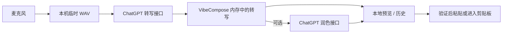

# VibeCompose

[English](README.md)

**面向 macOS 的开源语音写作工具。**按下 `F5` 开始口述，再按一次结束；
声明式 Skill 可以把结果整理成转写、回复、邮件、Bug 报告或其他结构化文本。

> [!IMPORTANT]
> VibeCompose 是独立、非官方的社区项目，与 OpenAI 不存在隶属、赞助或官方
> 背书关系。当前 Alpha 在用户使用自己的 ChatGPT 账户登录后，依赖 ChatGPT
> 未公开的网页端接口。这些接口可能随时变化或停止工作。

## Public Alpha 范围

首个公开版本只提供一条 Provider 路径：

1. 在默认浏览器连接 ChatGPT 账户；
2. 在本机录制音频；
3. 把录音发送到 ChatGPT 转写；
4. 可选地把转写和解析后的 Skill 指令发送到 ChatGPT 润色；
5. 预览、粘贴或复制结果。

VibeCompose 不提供自有账户，也不运营转写服务器。首版界面不提供 Provider
选择或 API Key 配置。

## 功能

- 原生 AppKit + SwiftUI 菜单栏应用，支持 macOS 13+
- 单快捷键开始/停止听写，默认 `F5`
- 浏览器 OAuth 登录，会话保存在 macOS Keychain
- 转写、术语对齐、可选 AI Polish 与安全交付
- 21 个经过审核的内置 Skill，以及本地声明式 Community Skill
- Skill Switcher、可编辑 Preview、脱敏运行回执和安全 Undo
- 按 Skill 授权的选中文本上下文与敏感应用拦截
- Writing Style、个人术语和内置 Domain Pack
- 保守的粘贴验证与剪贴板兜底
- 有上限的本地历史、失败录音 Recovery 与“删除全部数据”
- 英文和简体中文界面

Skill 是指令，不是可执行程序：它们不能运行 Shell、访问文件系统或自行发起
网络请求。

## 环境要求

- macOS 13 或更高版本
- 能使用所需上游能力的 ChatGPT 账户
- 源码构建需要 Xcode Command Line Tools
- 麦克风权限
- 自动粘贴需要辅助功能权限；未授权时结果保留在剪贴板

## 一键构建、安装并运行

```bash
git clone https://github.com/forever-ivy/vibecompose.git
cd VibeCompose
./scripts/build_and_run.sh
```

该命令会打包应用、安装到 `/Applications/VibeCompose.app`，并启动安装版。
日常开发检查使用：

```bash
./scripts/check.sh
```

本机没有 Apple 开发签名身份时：

```bash
VIBECOMPOSE_ALLOW_ADHOC_SIGNING=1 ./scripts/build_and_run.sh
```

临时签名适合本地开发，但重新构建后 macOS 可能要求重新授权麦克风和辅助功能。
权限验证必须使用 `/Applications/VibeCompose.app`，不要把
`dist/VibeCompose.app` 当作实际运行实例。

## OAuth 登录

1. 打开 **VibeCompose → 设置 → 通用**。
2. 点击 **使用浏览器登录**。
3. 在默认浏览器完成 OpenAI 授权。
4. 浏览器回到这台 Mac 上的本地回调地址。
5. 确认设置中显示 **ChatGPT — 已就绪**。

登录采用 OAuth 2.0 Authorization Code + PKCE。VibeCompose 不保存账户密码，
会话保存在 macOS Keychain 的 `app.vibecompose.mac.ChatGPTSession`。
详见 [ChatGPT OAuth](docs/engineering/chatgpt-oauth.md)。

## 隐私数据流



- 音频在远端处理：应用通过 HTTPS 直接把录音发送给 ChatGPT。
- 成功录音处理后删除；只有开启 Recovery 时才会限时、限量保留失败录音。
- AI Polish 可能发送转写、已解析 Skill Prompt、术语、已分配的 Writing
  Style 摘要，以及用户明确授权的选中文本。
- ChatGPT Token 保存在 Keychain。VibeCompose 不运营中转账户、分析、同步或
  转写服务。
- 本地产品指标默认关闭，并且不会自动上传。

阅读完整的[隐私数据流](docs/engineering/privacy-data-flow.md)和
[隐私政策](docs/legal/privacy-policy.zh-CN.md)。

## 本地数据

应用数据位于：

```text
~/Library/Application Support/VibeCompose/
```

| 数据 | 默认值 |
| --- | --- |
| 转写历史 | 开启 · 30 天 / 500 条 |
| 原始 ASR 文本 | 关闭 |
| 成功录音 | 处理后删除 |
| 失败录音 | 为 Retry 保留 · 24 小时 / 10 条 |
| 本地诊断 | 开启 · 14 天 / 1,000 条 |
| 本地产品指标 | 关闭 |

使用 **设置 → 上下文与隐私 → 删除全部数据** 可以删除本地应用数据和已保存的
ChatGPT 会话。

## 贡献

欢迎提交 Issue、Bug 复现、文档、翻译、Skill、测试和代码。

```bash
git checkout -b fix/short-description
./scripts/check.sh
```

不要在 Issue 或 Pull Request 中附加 ChatGPT Token、Cookie、录音、转写、
私有文档或原始崩溃报告。提交前请阅读 [CONTRIBUTING.md](CONTRIBUTING.md)、
[Community Skill 贡献指南](docs/engineering/community-skill-contribution-guide.md)
和 [SECURITY.md](SECURITY.md)。

## 仓库结构

```text
Sources/VibeCompose/          macOS 应用源码
Tests/VibeComposeTests/       单元与集成测试
scripts/                      构建、打包、安装与验收工具
website/                      静态项目网站和 Skill 目录
examples/skills/              Community Skill 模板
docs/                         产品、工程、隐私和发布文档
```

## 文档

- [文档索引](docs/README.md)
- [架构](docs/engineering/architecture.md)
- [ChatGPT OAuth](docs/engineering/chatgpt-oauth.md)
- [隐私数据流](docs/engineering/privacy-data-flow.md)
- [Skill Runtime](docs/engineering/skill-runtime.md)
- [发布流程](docs/engineering/release.md)
- [隐私政策](docs/legal/privacy-policy.zh-CN.md)
- [使用条款](docs/legal/terms-of-use.zh-CN.md)

## 许可证

MIT，见 [LICENSE](LICENSE)。

PermissionFlow、Sparkle 及其组件保留各自许可证。相关声明位于
[`Sources/VibeCompose/Resources/Legal`](Sources/VibeCompose/Resources/Legal)。
