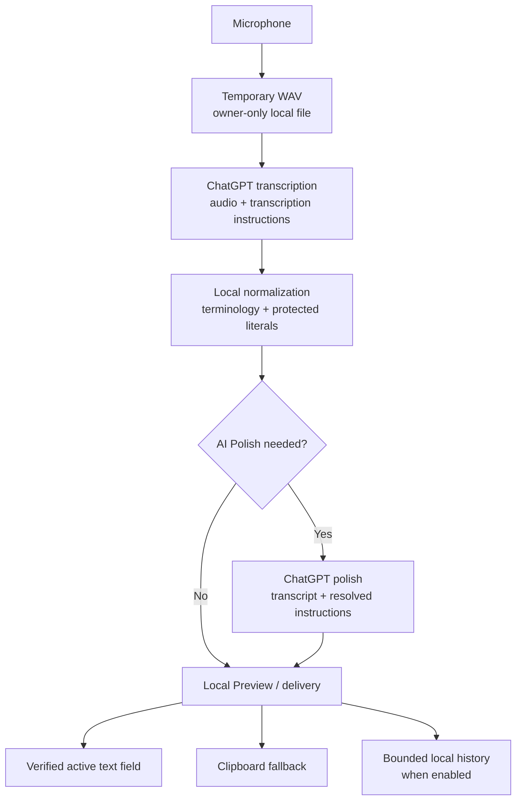

# Privacy Data Flow

VibeCompose is a local macOS client with remote processing through ChatGPT. It
does not operate an intermediary account, analytics, synchronization, or
transcription service.

## Data sent to ChatGPT

### Transcription request

- the recorded audio clip;
- transcription instructions;
- bounded language, punctuation, and terminology hints required by the active
  configuration.

### Optional polish request

- the transcript;
- the resolved declarative Skill prompt;
- relevant terminology;
- the assigned Writing Style summary;
- selected text only when that Skill has explicit permission to read it.

The app does not send the whole screen, the complete document, unrelated
installed Skill files, the full Skill Registry, or all application rules.

## Data retained on the Mac

| Data | Default behavior |
| --- | --- |
| ChatGPT session | Keychain until sign-out or Delete All Data |
| Successful recording | Deleted after processing |
| Failed recording | Recovery enabled; 24 hours / 10 records |
| Final transcript history | Enabled; 30 days / 500 records |
| Raw ASR text | Disabled |
| Diagnostics | Enabled; 14 days / 1,000 records |
| Local product metrics | Disabled; never uploaded automatically |
| Settings, terminology, Skills, styles | Until changed or deleted |

Application files live under
`~/Library/Application Support/VibeCompose/` and are created with owner-only
permissions where macOS supports them.

## Delivery

VibeCompose writes the result to the pasteboard. It sends `Cmd+V` only when it
can verify the current editable Accessibility target. Otherwise it keeps the
result in the clipboard for manual paste. Selected-text replacement is
cancelled if the target, range, or text digest changed.

## User controls

- disable or bound History, Recovery, diagnostics, and local metrics;
- disable raw transcript storage;
- exclude sensitive apps;
- revoke selected-text permission per Skill;
- delete individual records;
- sign out of ChatGPT;
- use **Delete All Data** to remove local app data and the Keychain session.

Deleting local data does not delete information already processed or retained
by ChatGPT. Use ChatGPT account controls for upstream data.

See the [Privacy Policy](../legal/privacy-policy.md) for the complete
disclosure.
