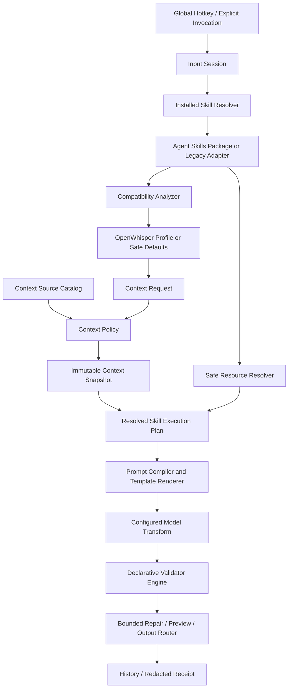

# OpenWhisper AI-native 输入层完整方案

> 日期：2026-07-14
> 最近修订：2026-07-18
> 状态：统一版 v6；当前 Alpha 的 Phase 0–11 仓库范围及安装版基础门禁完成；高级 Context Adapter、公共 Registry、外部 Action 与签名公开分发继续受独立门禁
> 当前基线：`0.1.0 Alpha`
> 范围：macOS 原生客户端、内嵌通用 Skill Engine、全局 Context、社区 Skill 生态、个性化、视觉反馈与可自定义全局热键
> 与现有计划的关系：本方案是当前 V1 听写闭环之上的 AI-native 实施主线，不替代签名、公证、更新、权限和安全粘贴等发布门禁。

## 实施进度更新

截至 2026-07-15，本方案定义的 Phase 0–9 macOS 本地产品能力已经进入源码、
配置迁移、双语 UI、自动化测试、安装版脚本和工程文档。Phase 10 已落地
Collection 的发现/分发数据模型、全局 Context Request / Policy / Snapshot /
Receipt 和来源目录；需要编辑器、终端或浏览器集成的高级 Adapter 继续保持不可用。
Phase 11 已落地签名索引、发布者允许列表、撤销、内容寻址缓存、Archive 哈希、
标准包复验和安装身份持久化，但 `remoteRegistryEnabled` 默认关闭，当前产品没有
预置公共 Registry 来源。外部 Action、Shell、MCP 和自定义网络能力仍未开放。

2026-07-18 已为生态验收线补齐非 UI 的 Community Pilot 启动工具包：30–50 人
招募与同意边界、15 个稳定任务、enum-only 参与者/观察/事件模板，以及不输出
cohort code 或逐行证据的本地汇总门禁。该工具包只把 CS-013 推进到可由产品所有者
批准启动的状态；仓库没有声称已招募参与者、开始四周研究或满足 Registry Go 条件。

同日补齐了非 UI 的签名发布 fail-closed 基础设施：候选阶段现在检查干净的权威 Git
来源、生产 HTTPS 配置、相互独立的 Sparkle / Provider Policy Ed25519 密钥和仓库外
owner-only 私钥；公开阶段把版本 tag、品牌清查、与精确 source commit / ZIP SHA-256
绑定的 installed-app 验收、Community Pilot 无逐行数据汇总及产品所有者人工复核
绑定到同一可归档报告。签名 gate 还逐一验证主 App 和 Sparkle 嵌套组件的 Developer
ID、Team ID、可信时间戳与 Hardened Runtime flag，并强制 Developer ID 候选使用
Swift `release` 构建配置而不是 `.build/debug`；App 与 DMG 的两次 Apple 公证还
必须分别留下 `Accepted` JSON 回执和不同 submission ID，并随精确候选归档。该基础设施不能替代真实凭据或
证据：当前品牌仍为 `blocked`，Pilot 尚未开始，生产签名、公证、HTTPS 托管和真实
更新/回滚也没有被声明完成；公开联系面 gate 还会拒绝当前仍写着“私有 Alpha”的
中英文政策，直到产品所有者提供并同步真实 support/security/privacy/legal URL 与
责任角色。因此公开签名分发继续阻断。

2026-07-15 的收口验收已从 `/Applications/OpenWhisper.app` 完成：
`scripts/check.sh`、三档窗口双语 Settings 快照、三种 Feedback Surface、
Reduce Motion / Increase Contrast、全部主要窗口的无障碍结构与视觉检查、
TextEdit 已确认插入和 Terminal 粘贴派发均通过。标准 Agent Skill Loader、Archive、
Legacy Adapter、Creator 导出/重导入、Collections 隔离和签名 Registry
下载/缓存/撤销/本地复验由回归测试覆盖。验收不改变远程 Registry 默认关闭、
高级 Context Source 显示为 unavailable 以及外部 Action 被拒绝的产品边界。

本文 v6 收敛下一阶段架构：Agent Skills 开放标准成为唯一公共创作格式；当前
`.openwhisperskill` v1 通过 Legacy Adapter 保持兼容；一个标准 Skill 对应一个主要
输出行为，相关 Skills 由 Collection 组织；可选 `openwhisper.yaml` 只补充 Host
Profile，不重复 `SKILL.md`。Context 升格为全局 Context Fabric，所有 Skill 仍由
OpenWhisper 内嵌 Skill Engine 执行。Codex、Claude Code 可以读取同一标准目录或
接收生成的 Prompt，但不是 OpenWhisper 调用或绑定的 Runtime。标准目录、可选
Host Profile、Legacy Adapter、Creator、Collections 和可信 Registry 管线现已进入
同一仓库实现；远程来源开放与高级 Context Adapter 仍受独立门禁约束。

“当前 Alpha 规划完成”在本文中的含义是：

- 当前 AI-native Alpha 的仓库内功能、数据模型、安全边界和回归测试已落地；
- 远程 Registry 默认关闭且没有预置来源；外部 Action 被明确排除；可信 Registry
  客户端只能下载签名索引声明的标准 Skill Archive，并必须重新经过本地扫描；
- 剩余事项属于签名公开分发与真实 installed-app acceptance：Developer ID、
  notarization、公共托管、品牌/主体/Beta、clean TCC、键盘、VoiceOver、
  Notes/第三方编辑器、更新和回滚证据；
- 自动化或 ad-hoc 安装版不能替代上述人工/生产证据，也不能把当前 Alpha
  描述为已完成签名公开分发。

Phase 1–3 已完成：

- `HotkeyBinding`、旧配置迁移、快捷键录制控件、组合校验；
- 候选快捷键预注册、配置持久化、失败回滚、启动时 F5 回退；
- 录制快捷键期间暂时释放全局监听，避免旧快捷键误触发；
- Onboarding、Settings、History、Menu、Ready、Recording 和 VoiceOver 动态显示当前快捷键；
- 统一 `FeedbackSurfaceController`；
- 顶部居中的 Refined HUD；
- AI Activity Glow；
- Hidden；
- Appearance & Feedback 设置、预览、声音与完成通知；
- Hidden 下的菜单 Retry 与 Esc 取消；
- Reduce Motion、Increase Contrast 和 VoiceOver 状态语义；
- 安装版三模式自动验收脚本。
- 十三个稳定、版本化的内置 Skill ID，其中五个面向 Community Pilot 的真实任务；
- Voice Mode 配置无损迁移到 `skills`，新配置不再写回旧键；
- 手动、本应用规则、全局默认和 Direct 回退的固定解析优先级；
- 录音开始时冻结 Skill ID、版本和解析来源；
- 固定安全外壳优先级的 Prompt Compiler；
- 非空、长度、JSON、Markdown 围栏、必填章节、技术字面量、禁用表达和内部标记校验；
- Validator 失败时在投递前回退规范化 ASR；
- History 与脱敏诊断中的受限 Skill ID、版本和校验问题码；
- Settings、中文本地化、README 与工程文档完成 Skills 术语迁移。
- `ContextConfig`、按 Skill 的每次询问 / 始终允许 / 永不允许；
- 未授权前不读取选区，敏感应用在捕获前直接拒绝；
- 选区字符预算、AX 目标、UTF-16 范围和 SHA-256 摘要冻结；
- Context Rewrite 与 Context Reply；
- 本地 Source / Result / Diff Preview；
- `OutputRouter` 对 automatic、preview 和 copy-only 的本地强制；
- 替换前再次校验同一 AX 元素、选区范围和原文摘要；
- 选区变化时只复制并显示 `Copied — selection changed`；
- Retry 配置主动清除选区正文；
- 脱敏诊断只记录上下文能力枚举和字符数；
- 安装版视觉验收增加 Diff Preview 截图。

Phase 4 已完成：

- Work Formal、Team Chat、Technical Writing、English Business、Personal Casual 五个内置 Style Capsules；
- Capsule 本地创建、样本文本本机分析、摘要编辑、按 Skill 分配、删除和导出；
- 样本文本只在创建界面内存中参与分析，生成摘要后清空，默认不持久化；
- Capsule 只对声明了 `styleCapsule` 能力且被用户分配的 Skill 生效；
- Backend Engineering、Medical Terminology、Kubernetes 三个内置 Domain Packs；
- 用户纠正、Skill 私有词条、用户普通术语、Domain Pack 和 ASR hints 的固定优先级；
- Pack 与用户词条的冲突显示；
- Medical 高风险 Pack 强制进入 Preview；
- 录音开始时冻结 Style Capsule、术语 Pack、合并词条和最高风险；
- 支持诊断只记录数量与风险，不记录 Capsule、Prompt、样本或术语正文。

Phase 5 已完成：

- `.openwhisperskill` v1 本地目录包导入；
- 受限 `skill.yaml`、`prompt.md`、`terminology.csv`、`validators.json`、本地化、示例和 Golden cases；
- 文件数、单文件、Prompt 和整包硬限制；
- 路径穿越、软链接、可执行位、shebang、Mach-O、脚本、动态库和未知文件拒绝；
- Community Skill v1 只允许 `voice`、可选 `selection` 和可选 `styleCapsule`；
- `externalAction`、`actionPreview`、自定义网络、进程、Keychain 和任意文件访问继续拒绝；
- 安装前权限、文件、输出策略和内容 SHA-256 审查；
- 多版本安装、活动版本选择、回滚、禁用和卸载；
- Skill Inspector 与本地 Golden contract runner；
- 配置保留未知或已卸载 Skill ID，运行时无法加载时安全回退 Direct；
- 示例模板与 SDK 文档进入仓库回归测试。

Phase 6 研究边界已完成：

- Registry 索引签名、包哈希、内容寻址缓存、密钥轮换、隔离和下架模型；
- Connector Broker、凭据隔离、固定端点、类型化操作和 Action Preview 约束；
- 明确 Registry 来源不能绕过本地包检查；
- 明确当前版本不开放远程 Registry、任意 Action、Shell、文件系统、自定义网络或通用 MCP。

对应实现与验收说明见：

- `docs/engineering/hotkey-and-feedback.md`
- `docs/engineering/skill-runtime.md`
- `docs/engineering/context-and-preview.md`
- `docs/engineering/community-skill-sdk.md`
- `docs/engineering/registry-and-actions-boundary.md`
- `scripts/feedback_mode_acceptance.sh`
- `scripts/visual_acceptance.sh`

当前实现已经开放本地 Style Capsules、内置 Terminology Packs、标准 Agent Skills
目录 / ZIP Archive、Legacy Community Skill v1、Skill Creator、本地 Collections、
Inspector、Golden tests 和兼容性分析。可信 Registry 管线已经实现但产品开关默认
关闭且没有预置公共来源；认证发布运营和 Action Skills 仍未开放。

## 0. 执行结论

OpenWhisper 不应继续只被定义为“语音转文字工具”，而应升级为：

> **macOS 上由语音、上下文和可组合 Skills 驱动的 AI 输入层。**

用户不只是在“说一段文字”，而是在表达意图。OpenWhisper 应结合当前任务、用户明确授权的上下文、专业术语和个人风格，把口述内容转换成可以直接发送、提交、粘贴或继续编辑的产物。

本方案确定以下产品决策：

1. 保留现有“一个快捷键开始、同一个快捷键停止”的单触发工作流。
2. 默认快捷键仍为 `F5`，但用户可以在 Settings 中录制并保存自己的全局快捷键。
3. 现有固定 Voice Modes 已迁移为声明式 Skills，并保持配置向后兼容。
4. 社区 Skill v1 只允许声明式配置、提示词、术语、示例和校验规则，不允许执行任意 Swift、JavaScript、Python、Shell 或任意网络代码。
5. 上下文必须按能力显式授权；首个版本只优先支持“用户选中文本”，不默认读取整个窗口、屏幕或文档。
6. 输出继续服从现有安全回填边界；Skill 无权绕过粘贴验证、敏感应用限制或 copy-only 策略。
7. HUD 提供三种模式：
   - `Refined HUD`：默认，高级、紧凑、重新设计的标准状态框；
   - `AI Activity Glow`：可选，冷蓝色克制跑马灯式边缘信号；
   - `Hidden`：完全隐藏视觉 HUD，仅保留可选声音和菜单栏状态。
8. AI Activity Glow 使用冷蓝、靛蓝、冰蓝和少量青色高光，不复制 Apple Intelligence 的彩虹、轨迹或品牌表达。
9. 第一阶段不做插件市场、不做常驻屏幕读取、不做任意 Action、不做自动执行 Shell/SQL、不做网站级深度适配。
10. Agent Skills 开放标准是未来唯一公共创作格式；`SKILL.md` 是必需入口，
    `skill.yaml + prompt.md` 只由 v1 Legacy Adapter 读取。
11. 一个标准 Skill 对应一个主要输出行为；医学、Prompt Writer 等相关能力通过
    `SkillCollection` 组织，不在公共格式中增加私有多 Entrypoint。
12. `openwhisper.yaml` 是可选 Host Profile，只声明 Context、资源、输出、风险和
    Validator；没有它的标准 Skill 仍可按安全默认值运行。
13. Context 是全局一等能力。Skill 只能提出 Context Request，不能直接读取
    Accessibility、文件、终端、浏览器、剪贴板、Keychain、MCP 或网络。
14. 所有兼容 Skill 都由 OpenWhisper 内嵌 `SkillExecutionEngine` 执行，共用
    Prompt Compiler、Context Fabric、Validator、Preview 和 Output Router。
15. 标准包可包含其他 Host 使用的脚本和元数据，但 OpenWhisper 永不执行脚本、
    Shell、Hooks、MCP 或自定义网络；依赖这些能力的 Skill 标记为不兼容。
16. OpenWhisper Skill 生态独立存在，不依赖 Codex、Claude Code 或其他应用；
    “生成 Codex Prompt”只是一个输出场景，不是外部 Agent 调用。

## 1. 当前产品基线

### 1.1 已有可复用能力

OpenWhisper 当前已具备 AI-native 输入层的本地运行底座：

- 原生 AppKit + SwiftUI 菜单栏应用；
- 可自定义全局快捷键，默认 `F5` 开始、同键停止；
- 麦克风录音、转写、术语对齐和可选 AI Polish；
- Direct、Reply、Email、Backend Prompt、Code Prompt、Translate、Context Rewrite、Context Reply；
- 按精确 Bundle Identifier 选择 Skill；
- 用户授权选区、Diff Preview 和安全选区替换；
- Style Capsules、分层术语和三个内置 Domain Packs；
- 本地声明式 Community Skill 导入与版本管理；
- 保守自动粘贴、确认插入、仅发送粘贴和剪贴板兜底；
- Retry、History、Recovery、诊断和隐私留存策略；
- 敏感应用排除；
- HUD 的 Recording、Processing、Success、Copied、Error、Retry；
- Reduce Motion、Increase Contrast 和 VoiceOver 状态播报；
- 安装版打包、安装、视觉验收和 TextEdit 粘贴验收。

### 1.2 当前实现与目标差距

| 能力 | 2026-07-14 已实现 | 下一边界 |
| --- | --- | --- |
| 触发热键 | `HotkeyBinding` 保存键码和修饰键；录制、冲突检测、原子切换、失败回滚和 F5 启动回退已完成 | 保持单快捷键开始/停止；未来单独研究多动作快捷键 |
| Voice Mode / Skill | 十三个内置声明式 Skills；稳定 ID、版本、迁移、Resolver、Prompt Compiler 和 Validator 已完成 | 依据真实 Pilot 证据改进官方 Skills，但不增加任意代码能力 |
| 应用规则 | 精确 Bundle Identifier，录音开始时冻结 | Bundle ID 继续作为稳定基础；网站或工作区适配必须另行授权 |
| 上下文 | 只读取用户授权的选区；支持 Style Capsule；不读取完整窗口、屏幕或文档 | `focusedParagraph` 和有限会话窗口仍未开放 |
| 术语 | 用户词典 + Skill 私有术语 + Backend/Medical/Kubernetes Domain Packs | 后续可增加经过审查的 Pack，但优先级和高风险 Preview 不变 |
| AI Polish | 固定安全外壳 + Skill Prompt Compiler + 本地 Validator + ASR 回退 | 提升质量评估，不放宽本地安全顺序 |
| HUD | Refined HUD、AI Activity Glow、Hidden 三模式 | 继续优化安装版多显示器和无障碍证据 |
| 社区扩展 | 本地 `.openwhisperskill` v1、Inspector、多版本和 Golden tests | Agent Skills 标准导入、Collections 与远程 Registry 尚未开放 |
| 外部动作 | 未开放，导入时拒绝 `externalAction` 和 `actionPreview` | 不属于 Skill Engine；只在独立产品边界中研究有限集成 |

## 2. 产品定位

### 2.1 新品类定义

OpenWhisper 的长期品类不是输入法，也不是聊天机器人，而是：

> **Intent-to-Output Layer / 意图到产物的输入层**

```text
语音意图
+ 用户明确授权的上下文
+ 当前应用与任务
+ Skill、术语和个人风格
→ 可验证、可预览、可安全投递的结果
```

### 2.2 核心用户

优先服务：

- 使用 Codex、Cursor、Claude Code、Xcode、VS Code 的开发者；
- 产品经理、创始人、研究者和内容工作者；
- 中英文混输且经常使用技术术语的人；
- 需要快速完成邮件、Issue、PR、方案、回复和提示词的人；
- 希望拥有个人表达风格，但不希望应用常驻读取屏幕的人；
- 已经拥有 ChatGPT 账户、不想额外维护复杂模型配置的人。

### 2.3 核心价值

- **说完即可交付**：得到的不是粗糙转写，而是任务需要的结果。
- **同一句话因场景而不同**：在编码工具中成为开发任务，在邮件中成为完整邮件，在聊天中成为简短回复。
- **专业词汇稳定**：路径、命令、API、药名、产品名和缩写不被随意改写。
- **风格一致**：可选择自己的 Style Capsule，而不是每次重复描述语气。
- **权限透明**：用户知道本次读取了什么、发给了哪个模型、如何投递。
- **失败可恢复**：不能安全回填时保留到剪贴板，不能验证时不冒充成功。

## 3. 产品原则与非目标

### 3.1 产品原则

1. **一个动作完成一次输入**
   - 一个全局快捷键开始；
   - 同一个快捷键停止；
   - `ESC` 和 HUD 关闭按钮取消。
2. **默认最小权限**
   - Skill 默认只有 `voice`；
   - 选区、局部上下文、风格档案和外部动作分别授权。
3. **上下文由用户决定**
   - 不把“智能”建立在无提示读取整个屏幕之上。
4. **系统规则高于 Skill**
   - Skill 不能修改隐私、凭据、网络、粘贴和留存边界。
5. **高风险结果先预览**
   - 医疗、法律、财务、命令、SQL、外部写入默认不直接投递。
6. **输出必须可验证**
   - JSON、Markdown、代码块、模板字段和关键字面量应通过本地校验。
7. **向后兼容**
   - 旧 Voice Mode、`F5` 默认值、现有术语和历史记录不能因迁移失效。
8. **原生 Mac 体验优先**
   - Settings、快捷键录制、状态反馈、动画和无障碍应符合 macOS 交互习惯。

### 3.2 近期非目标

- 常驻监听或唤醒词；
- 默认读取整个屏幕；
- 任意代码插件；
- 任意文件系统访问；
- Skill 自行持有 ChatGPT 会话或 API Key；
- 自动执行 Shell、SQL、Git 或生产环境操作；
- 未经确认发送邮件、消息、Issue 或任务；
- 浏览器扩展和网站 DOM 深度读取；
- 团队知识库、企业审计后台和复杂权限中心；
- Windows、iOS、Android 同期开发。

## 4. 目标用户体验

### 4.1 普通听写

```text
聚焦输入框
→ 按自定义快捷键（默认 F5）
→ 录音
→ 再按同一快捷键
→ ASR + Direct Skill
→ 安全回填或剪贴板兜底
```

### 4.2 后端开发提示词

```text
在 Codex/Cursor 中触发
→ 自动解析当前 App 对应的 Backend Prompt Composer
→ 用户口述需求
→ 输出目标、背景、约束、实现步骤、边界情况、验收标准
→ 预览或安全回填
```

### 4.3 选中文本改写

```text
用户选中一段文本
→ 触发 OpenWhisper
→ 说“保持这个语气，缩短一半，但保留日期和数字”
→ Skill 只读取选区
→ 展示 Diff
→ 仅在同一 AX 元素、同一选区仍未变化时允许替换
→ 否则只复制结果
```

### 4.4 个人风格回复

```text
选择工作邮件 Style Capsule
→ 选中对方邮件中的必要段落
→ 口述回复意图
→ 输出符合用户工作风格的邮件正文
→ 预览确认
```

### 4.5 专业术语听写

```text
启用医学术语包
→ 口述药名、检查项和缩写
→ ASR 提示 + 确定性术语纠正
→ 只做转写和格式化，不补全诊断事实
→ 默认预览
```

## 5. OpenWhisper Skill Engine

### 5.1 标准选择

OpenWhisper 的公共 Skill 创作格式采用 **Agent Skills 开放标准**，不再设计一套
并列的 Community Skill v2 格式。Codex 和 Claude Code 都以该标准的
`SKILL.md` 目录为公共基础；OpenWhisper 作为第三种独立 Host，只实现与语音输入
和输出定制相关的运行语义。

标准依据：

- [Agent Skills Specification](https://agentskills.io/specification)；
- [Codex — Build skills](https://learn.chatgpt.com/docs/build-skills.md)；
- [Claude Code — Extend Claude with skills](https://code.claude.com/docs/en/slash-commands)。

这项决策保证开源作者可以复用同一个目录、`SKILL.md`、References、Assets 和示例，
不需要为 OpenWhisper 重写一份 Prompt 包。格式兼容不表示所有 Host 能力相同：
Codex、Claude Code 可以使用工具或脚本；OpenWhisper 只把兼容内容编译成语音输出
转换计划，不调用这些产品，也不执行它们的 Agent 工作流。

### 5.2 Skill 的公共定义

一个可移植 Skill 是一个目录，且必须包含 `SKILL.md`：

```text
medical-clinical-note/
├── SKILL.md                 # required: metadata + instructions
├── references/              # optional: domain knowledge
├── assets/                  # optional: templates and static resources
├── scripts/                 # optional in the standard; never executed by OpenWhisper
├── agents/
│   └── openai.yaml          # optional Codex metadata; ignored by OpenWhisper
└── openwhisper.yaml         # optional OpenWhisper Host Profile
```

公共最低契约：

- 目录名与 `SKILL.md` 的 `name` 一致；
- `name` 使用小写字母、数字和连字符，最多 64 个字符；
- `description` 同时说明“做什么”和“何时使用”，最多 1,024 个字符；
- Markdown 正文是 Skill 的唯一主指令来源；
- `references/` 和 `assets/` 通过相对路径引用；
- `license`、`compatibility`、`metadata` 和 `allowed-tools` 按开放标准解析；
- Host 私有扩展可以共存，但不能改变公共标准字段的含义。

标准示例：

```markdown
---
name: medical-clinical-note
description: 将医学语音整理成结构化临床记录。用于病历口述、诊疗记录和医学术语听写。
license: Apache-2.0
compatibility: Works as an instruction-only Skill in OpenWhisper, Codex, and Claude Code.
metadata:
  author: example-org
  version: "1.0.0"
  openwhisper-id: com.example.medical-clinical-note
---

把用户口述整理成临床记录。

1. 保留药品、剂量、检查结果和医学缩写。
2. 不补充用户没有口述的医学事实。
3. 按主诉、检查结果和计划组织内容。
4. 缺失信息保持为空，不自行推断。

术语和格式要求见 `references/terminology.md`。
```

### 5.3 OpenWhisper Host Profile

纯 Agent Skills 标准目录无需修改即可导入 OpenWhisper。没有 Host Profile 时使用
安全默认值：

```text
input      = voice only
context    = none
format     = plainText
risk       = medium
delivery   = previewThenPaste
validators = app defaults
```

需要确定性 Context、模板、术语、Validator 或投递策略时，可增加可选
`openwhisper.yaml`。它是标准目录允许的 Host 扩展，不是第二份 Skill 定义，也不能
重复或替代 `SKILL.md` 主指令：

```yaml
schemaVersion: 1

context:
  optional:
    - selection

resources:
  terminology: references/terminology.csv
  template: assets/clinical-note.md
  examples: references/examples.jsonl
  goldenTests: references/golden.jsonl

output:
  format: markdown
  delivery: previewThenPaste
  risk: high

validators:
  preserveTechnicalLiterals: true
  maximumCharacters: 12000
  requiredSections:
    - 主诉
    - 检查结果
    - 计划
```

Profile 只能请求 OpenWhisper 已实现的能力。最终授权、字符预算、风险升级、Preview
和安全投递仍由 App 决定；Profile 不能授予文件、网络、工具、Keychain、MCP 或
外部 Action 权限。

### 5.4 一 Skill 一主要输出行为

Agent Skills 的公共入口是一个目录中的一个 `SKILL.md`。为了保持真正的跨 Host
可移植性，OpenWhisper 社区格式采用：

> **一个 Skill 对应一个主要语音输出行为。**

不在公共格式里增加 OpenWhisper 私有的多 Entrypoint 模型。相关能力通过
`SkillCollection` 在展示和分发层组合：

```text
Medical Collection
├── medical-clinical-note/SKILL.md
├── medical-medication-list/SKILL.md
└── medical-referral-letter/SKILL.md

Prompt Writer Collection
├── coding-prompt/SKILL.md
├── research-prompt/SKILL.md
└── image-prompt/SKILL.md
```

Collection 不是执行容器，不合并权限，也不让 Skill 相互调用。它只提供分类、批量
安装、统一发布者、兼容版本和更新策略。用户仍然单独启用、授权、路由和运行每个
Skill。

### 5.5 Host 兼容性分级

OpenWhisper 不宣称所有 Codex / Claude Code Skill 都能等价运行，而是提供明确的
兼容性报告：

| 等级 | 内容 | OpenWhisper 行为 |
| --- | --- | --- |
| Portable | `SKILL.md` + 文本 References / Assets | 完整支持 |
| OpenWhisper Enhanced | Portable + `openwhisper.yaml` | 完整支持 Context、输出和 Validator 契约 |
| Vendor Extended | `agents/openai.yaml`、Claude 私有 Frontmatter 等 | 保留并忽略与 OpenWhisper 无关的元数据 |
| Tool-dependent | `allowed-tools`、Bash、MCP、文件写入、Hooks、Subagent | 标记不兼容，不启用依赖能力 |
| Executable-dependent | `scripts/`、动态命令或二进制 | 不执行；若主流程依赖它们则拒绝启用 |

为保持同一开源目录的完整性，安装器可以保存脚本和未知供应商文件的原始字节用于
哈希与跨 Host 转发，但必须：

- 安装副本统一写为 `0600`，不保留可执行位；
- 放入不可执行、不可加载的隔离资源区；
- 不把脚本正文送入模型；
- 不允许 `SkillResourceResolver` 返回脚本或二进制；
- 检测到 `!command`、Hooks、工具依赖或必须运行脚本的指令时标记不兼容；
- Inspector 明确显示“标准格式兼容”和“OpenWhisper 运行兼容”是两个状态。

### 5.6 当前 v1 与迁移边界

当前已经实现的 `.openwhisperskill` v1 使用：

```text
Legacy.openwhisperskill/
├── skill.yaml
├── prompt.md
├── terminology.csv
├── validators.json
├── examples.jsonl
├── localizations/
└── tests/golden.jsonl
```

它继续受支持，但从 Phase 8 开始只作为 `LegacyOpenWhisperV1Adapter` 输入，不再是
新作者的推荐格式：

```text
Legacy skill.yaml + prompt.md
→ LegacyOpenWhisperV1Adapter
→ normalized AgentSkillPackage + OpenWhisperSkillProfile
→ existing SkillExecutionEngine
```

迁移要求：

- 不修改用户已安装 v1 包；
- 保留稳定 ID、版本、App Rule、History 和回滚状态；
- Skill Creator 默认导出 Agent Skills 标准目录；
- 可选择把 v1 包导出为标准 `SKILL.md` + `openwhisper.yaml`；
- `.openwhisperskill` 仅保留为可选运输包装，不再是公共创作格式；
- 普通目录、ZIP/Registry Archive 解包后都必须得到同一标准 Skill 目录。

### 5.7 身份、版本与来源

Agent Skills 标准要求 `name`，但不强制全局 ID 和版本。OpenWhisper 不能继续把
公共 `name` 当作唯一安装身份：

```text
Portable identity
├── name / description / license / compatibility
└── optional metadata

OpenWhisper installation identity
├── installationID
├── registryPackageID or local source ID
├── resolved version or local revision digest
├── publisher
└── content SHA-256
```

规则：

- Registry 安装的 ID、版本、发布者和签名由签名索引提供；
- 本地目录可以通过 `metadata.openwhisper-id` 和 `metadata.version` 提供稳定信息；
- 缺少扩展信息时由 App 分配本地 `installationID`，内容哈希作为 revision；
- App Rule、权限和历史引用 `installationID`，不直接依赖目录名；
- 同名 Skill 不合并，由来源、发布者和安装身份区分；
- 更新后保留旧 revision，支持回滚和撤销。

### 5.8 渐进披露与资源解析

OpenWhisper 采用与 Agent Skills 一致的渐进披露思想，但由内嵌引擎执行：

1. **Catalog**：常驻只加载 `name`、`description`、来源、兼容状态和路径；
2. **Instructions**：Skill 被解析后加载完整 `SKILL.md` 正文；
3. **Resources**：只按相对引用、Host Profile 和本次任务需要加载受支持资源。

`SkillResourceResolver` 必须执行：

- 路径归一化和根目录约束；
- MIME / 扩展名、大小、数量和 Token 预算；
- References 一层优先，限制深层递归引用；
- 文本、模板、CSV、JSON/JSONL 和受支持静态资源白名单；
- 脚本、动态库、二进制、软链接和设备文件永不返回；
- 本次实际加载资源进入脱敏 Receipt，但不记录正文。

### 5.9 运行流水线

```text
全局热键或显式选择
→ 创建 InputSession
→ 冻结目标与 Skill 安装身份
→ 加载 SKILL.md 与 OpenWhisper Profile
→ 运行兼容性分析
→ 根据 Profile 生成 Context Request
→ Context Policy 批准后创建 Snapshot
→ 解析受支持 References / Assets
→ Technical Literal 与术语保护
→ Skill Prompt Compiler
→ OpenWhisper 配置的模型转换
→ 声明式 Validator Engine
→ 一次有界修复或 ASR 安全回退
→ Diff / Preview / Output Router
→ History / Recovery / 脱敏 Receipt
```

Skill 始终位于 OpenWhisper 系统安全与事实保真外壳之后。即使其输出是给 Codex、
Claude Code 或其他应用使用的 Prompt，OpenWhisper 也只生成和投递文本。

### 5.10 解析、发现与组合

Skill 解析优先级：

1. 用户本次显式选择；
2. 当前 App 的用户规则；
3. 当前 Workspace / 文件类型规则，未来能力；
4. 基于 `description` 的可选本地语义匹配，必须可关闭且显示命中原因；
5. 全局默认 Skill；
6. 内置 `Direct`。

Skill 在录音开始时冻结，避免录音期间切换 App 导致指令、权限或投递变化。

运行时只允许受控组合：

```text
OpenWhisper System Contract
→ selected Skill / SKILL.md
→ optional Domain Pack
→ Team Profile
→ User Terminology and Style Capsule
→ OpenWhisper Output Template
→ Declarative Validators
```

Skill 不能调用另一个 Skill；Collection 不能改变上述顺序；冲突按固定优先级解决。

### 5.11 Skill Creator、Inspector 与测试

Skill Creator 面向两类作者：

- 普通用户通过表单编辑名称、描述、指令、模板、术语、示例、Context 和 Validator；
- 高级作者直接编辑标准 `SKILL.md`、References、Assets 和可选 `openwhisper.yaml`。

Creator 默认生成可被其他 Agent Skills Host 读取的标准目录，不生成新的
`skill.yaml + prompt.md` 包。Inspector 必须显示：

- Agent Skills 标准校验结果；
- OpenWhisper 兼容等级及不兼容原因；
- 最终安装身份、来源、版本 / revision 和内容哈希；
- `SKILL.md`、实际加载 Resources 和被隔离文件；
- 本次 Context Request、授权类别和字符数；
- 编译后的系统约束、Skill 指令和输出契约；
- Validator 失败原因和安全回退；
- Golden cases、跨语言、空输入、超长输入和技术字面量测试；
- 不含用户正文的可导出诊断。

Golden tests 属于 OpenWhisper 的作者工具和 Registry 质量层，不要求其他 Host 执行，
也不能调用 Provider、脚本或外部工具。

### 5.12 能力上限与用户定制

通用 Skill 的上限来自指令、知识、Context、模板、校验、组合和社区分发，而不是
任意代码：

| 等级 | 能力 | 例子 |
| --- | --- | --- |
| Level 0 — Portable Instructions | 标准 `SKILL.md`、描述、示例 | Direct、Reply、Email、Prompt Writer |
| Level 1 — Structured Output | Assets 模板、章节、JSON、表格、表单 | 病历、会议纪要、Issue、研究 Prompt |
| Level 2 — Domain Skill | References、术语、领域规则和高风险约束 | 医学、法律、代码、销售、客服 |
| Level 3 — Context-aware | 选区、焦点段落、当前文件和有限会话 | 根据选区回复；根据报错生成 Bug Report |
| Level 4 — Composition & Personalization | Domain Pack + Team Profile + Style + Template | 医院科室模板、团队技术写作、个人商务英语 |
| Level 5 — Trusted Community Ecosystem | Collection、签名 Registry、更新、撤销和回滚 | 官方、团队和社区分发 |

用户可定制：

| 维度 | 内容 | 示例 |
| --- | --- | --- |
| 语音整理 | 口头禅、重复、自我纠正、标点、段落、语言 | 保留口语；整理成正式书面语 |
| 专业语言 | 术语、缩写、固定拼写、References | 药名、ICD 缩写、API、类名、产品名 |
| 输出结构 | Skill、章节、模板、字段、顺序和格式 | SOAP 病历、Bug Report、Prompt、会议纪要 |
| 表达风格 | 语气、正式度、长度、受众、Style Capsule | 医患沟通、商务英语、团队技术写作 |
| Context | 选区、焦点段落、当前文件或有限会话 | 根据选中邮件回复；根据错误整理缺陷描述 |
| 质量规则 | 必填字段、技术字面量、长度、禁止臆造 | 药品剂量必须保留；未口述信息不得补充 |
| 投递方式 | 自动粘贴、预览后粘贴、仅复制 | 普通听写直达；医疗记录始终预览 |
| 路由规则 | 默认、App、Workspace、文件类型、收藏 | 医院系统默认病历；IDE 默认 Code Prompt |

面向不同用户：

- **普通用户**：安装标准 Skill，选择风格、术语和 App Rule；
- **专业人士**：Fork 医学、法律、金融 Skill，加入机构模板、词表和校验；
- **开发者**：定义技术 Prompt、Issue、Bug Report 和 Commit Message 输出；
- **团队管理员**：分发 Collection、锁定 Registry 版本、模板和允许列表；
- **开源作者**：维护一份标准目录，同时服务 OpenWhisper、Codex、Claude Code 等 Host；
- **高级作者**：增加可选 OpenWhisper Profile，但仍受内嵌声明式执行边界约束。

## 6. Context Fabric：全局上下文与权限系统

当前 `ContextBroker`、选区权限和 `SkillPromptContext` 是 Context Fabric 的第一阶段
实现。目标是让 Context 成为跨 Skill、Preview、History 和 Output 的
全局能力，而不是继续向某个 Prompt Context 结构堆字段。

### 6.1 权限能力

权限不是简单的“允许读取屏幕”，而是独立能力：

| 权限 | 内容 | 默认 |
| --- | --- | --- |
| `voice` | 当前录音转写 | 必需 |
| `selection` | 用户明确选中的文本 | 关闭，按 Skill 授权 |
| `focusedParagraph` | 当前焦点附近的有限文本 | 关闭 |
| `conversationWindow` | 受支持应用中最近有限条目 | 关闭 |
| `clipboard` | 当前剪贴板文本 | 关闭 |
| `styleCapsule` | 用户选择的风格档案 | 关闭，按 Skill 选择 |
| `externalAction` | 创建、发送或更新外部对象 | v1 不支持 |

### 6.2 上下文授权卡

安装或首次运行 Skill 时显示：

> Backend Prompt Composer 将读取：
> - 本次语音
> - 当前选中文本，最多 6,000 字符
>
> 不会读取：
> - 其他文件
> - 终端历史
> - 完整屏幕
> - 剪贴板
>
> 输出方式：预览后回填

用户可以：

- 允许一次；
- 始终允许此 Skill；
- 拒绝并仅使用语音；
- 打开 Settings 查看和撤销权限。

### 6.3 最小化规则

- 只读取完成任务所需的最小范围；
- 每种上下文有字符数上限；
- 上下文在会话结束后释放，不进入普通诊断；
- History 默认只保存最终结果，不保存上下文正文；
- Skill 只能得到 Context Broker 返回的快照，不能直接调用 Accessibility API；
- Provider 请求中不发送完整应用规则表、安装 Skill 列表或无关 App 信息；
- 应用名称、Bundle ID 和上下文类别只在需要解析 Skill 时本地使用。

### 6.4 敏感应用

密码管理器、Keychain、系统“密码”、用户添加的敏感 App 默认：

- 只允许 `voice`；
- 禁止 `selection`、`focusedParagraph`、`conversationWindow` 和 `clipboard`；
- 禁止 History 和 Recovery 正文；
- 禁止自动回填，除非现有安全策略明确允许且用户单独覆盖；
- AI Activity Glow 和 Refined HUD 不显示转写正文。

### 6.5 选中文本安全替换

选中文本改写必须满足：

1. 录音开始时记录 AX 元素身份、选区范围和选中文本摘要；
2. 结果返回时重新确认是同一 AX 元素；
3. 选区范围和原文本未发生变化；
4. 当前目标仍是可编辑目标；
5. Skill 投递策略允许替换；
6. 高风险 Skill 已经预览确认。

任何条件不满足时：

- 不自动替换；
- 保留结果到剪贴板；
- HUD 明确显示 `Copied — selection changed`；
- Preview 中允许用户重新选择目标。

### 6.6 网站与会话上下文

第一阶段只使用 Bundle Identifier 和 Accessibility 可证明的选区。网站域名、网页 DOM、聊天线程和编辑器工作区属于后续适配层。

引入时必须满足：

- 使用显式浏览器扩展或受支持适配器；
- 用户知道正在读取哪个网站和哪一段内容；
- 不把浏览器历史、其他标签页或完整页面默认发送给模型；
- 网站规则与 App 规则分开授权；
- 不因网页内容中的提示词改变系统权限或输出安全策略。

### 6.7 Context Fabric 目标模型

“全局 Context”不表示后台持续读取内容，而表示所有来源、授权、预算、快照和
Receipt 使用同一套产品与运行时契约：

```text
Context Source Catalog
→ Context Request
→ Context Policy
→ app-owned Source Adapter
→ immutable Context Snapshot
→ Skill Execution Plan
→ Context Receipt
```

Skill 的 OpenWhisper Profile 只能提出 `ContextRequest`。Context Policy 按以下优先级决定实际
可提供内容：

```text
系统永久拒绝
→ 敏感 App / 目标拒绝
→ Source 全局开关
→ OpenWhisper Source 能力限制
→ Skill Context Request
→ Skill + Source 持久授权
→ 本次授权
→ 字符、Token、条目和时间预算
```

正文只能在 Policy 批准后按需读取。Bundle ID、应用名称、目标是否可编辑和是否
存在选区等非正文元数据可用于本地路由，但不能被当作读取正文的授权。

### 6.8 Context Source 路线

| Source | 内容 | 默认 | 状态/顺序 |
| --- | --- | --- | --- |
| `voice` | 本次录音与转写 | 必需 | 已完成 |
| `selection` | 用户显式选中文本 | 每次询问 | 已完成 |
| `activeApp` | App 名称与 Bundle ID | 本地解析 | 已完成 |
| `styleCapsule` | 用户批准的风格摘要 | 按 Skill 分配 | 已完成 |
| `terminology` | 用户、Skill 和领域术语 | 本地合并 | 已完成 |
| `focusedParagraph` | 焦点附近有限正文 | 关闭 | 下一 Context 阶段 |
| `openFile` | 当前文件或用户指定文件 | 关闭 | 编辑器阶段 |
| `workspace` | 用户明确选择的项目范围 | 关闭 | 编辑器阶段 |
| `editorDiagnostics` | 有限错误与警告 | 关闭 | 编辑器阶段 |
| `terminalSession` | 用户选择的有限终端片段 | 关闭 | 后续 Adapter |
| `browserPage` | 当前授权页面有限正文 | 关闭 | 后续 Adapter |
| `conversationWindow` | 受支持应用最近有限条目 | 关闭 | 后续 Adapter |
| `clipboard` | 当前剪贴板正文 | 关闭 | 单独评审 |

### 6.9 Context Snapshot

每个不可变 Context Item 至少包含：

```text
source ID
purpose
content or local opaque reference
character/token count
capturedAt / expiresAt
source application
sensitivity
truncation state
content digest
authorization source
```

规则：

- Snapshot 创建后不可修改，默认只在当前 `InputSession` 中有效；
- Retry 默认不复用正文；
- 切换 Skill 后重新计算 Context Request；
- 切换 Skill 后同时重新冻结资源、输出、风险与可用 Context；
- History 和诊断默认只保存 Source 枚举、计数、风险和状态，不保存正文；
- Context 正文类型默认不实现 `Codable`，避免意外进入配置或日志；
- Skill 只能消费 Snapshot，不能直接调用 Source Adapter。

## 7. Style Capsule：个人风格胶囊

### 7.1 产品定义

Style Capsule 是用户主动创建、可查看、可编辑、可删除的个人表达档案，而不是隐式抓取历史。

一个 Capsule 可以描述：

- 正式程度；
- 句子长度；
- 技术密度；
- 是否使用项目符号；
- 常用称呼和结尾；
- 中英文比例；
- 偏好的礼貌程度；
- 常用术语；
- 禁用词和不喜欢的表达；
- 示例片段。

### 7.2 创建流程

```text
用户选择 5–30 段自己的文本
→ 显示将发送给哪个模型
→ 生成可读的风格摘要
→ 用户编辑和确认
→ 保存 Capsule
→ 默认删除源文本，仅保存风格摘要和用户保留的示例
```

建议预置：

- Work Formal；
- Team Chat；
- Technical Writing；
- English Business；
- Personal Casual。

### 7.3 边界

- 不自动扫描邮件、消息或文档；
- 不建立第三方作者模仿库；
- 不把 Style Capsule 当作事实来源；
- 不覆盖 Skill 的必填结构和安全规则；
- Capsule 在本机可导出和删除；
- 原始样本文本是否保留必须单独选择，默认不保留。

## 8. Terminology Packs

现有 Terminology Dictionary 演进为三层：

1. **Personal Dictionary**
   - 用户自己的产品名、人名、缩写和纠正规则。
2. **Domain Pack**
   - 医学、法律、Kubernetes、FastAPI、Apple 平台等可安装词库。
3. **Skill-local Terminology**
   - 仅在特定 Skill 中生效的模板字段和专有表达。

合并优先级：

```text
用户显式纠正规则
> Skill 私有词条
> 用户普通术语
> 领域包术语
> ASR 原始结果
```

冲突必须在安装或启用时可见，不能静默覆盖用户词条。

## 9. 输出、预览与安全投递

### 9.1 输出类型

- `plainText`
- `markdown`
- `code`
- `json`
- `template`
- `actionPreview`，未来能力

### 9.2 投递策略

| 策略 | 行为 | 适用 |
| --- | --- | --- |
| `automaticPasteWhenVerified` | 沿用现有安全回填；无法证明时复制 | Direct、低风险 Reply |
| `previewThenPaste` | 展示结果或 Diff，确认后投递 | Backend Prompt、邮件、上下文改写 |
| `copyOnly` | 永不自动回填 | Shell、SQL、Retry、高风险专业 Skill |

### 9.3 Preview

Preview 至少支持：

- 原始转写与最终结果切换；
- 文本 Diff；
- 重新运行；
- 切换 Skill；
- 切换 Style Capsule；
- 复制；
- 替换选区；
- 插入到光标；
- 报告“不是我的风格”；
- 显示本次读取的上下文类别；
- 显示结果是否通过 Validator。

Preview 不是每次都出现。Direct 的低风险短输入继续追求低延迟自动回填。

### 9.4 Validator

首批本地校验：

- 最大长度；
- 非空；
- JSON 可解析；
- Markdown 代码围栏闭合；
- 必填章节存在；
- 技术字面量全部且只出现一次；
- 日期、数字、路径、命令和版本未丢失；
- 禁止出现 Skill 声明之外的事实补全提示；
- 高风险输出必须进入 Preview；
- 输出不包含内部 Prompt 或上下文标记。

Validator 失败时不直接投递，可：

- 以更严格 Prompt 重试一次；
- 回退到原始 ASR；
- 只复制并提示校验失败；
- 保留 Recovery 信息，但不记录上下文正文。

## 10. 社区 Skill 生态

### 10.1 分阶段模型

#### Phase A：官方 Skills（已完成基础集）

- 随 App 发布；
- 完整测试与双语本地化；
- 明确权限、风险和输出；
- 与 App 版本一起回归。

#### Phase B：Legacy v1 本地导入（已完成）

- 用户导入 `.openwhisperskill` v1；
- `skill.yaml + prompt.md` 由现有受限 Loader 读取；
- 安装前查看作者、版本、权限、文件和内容哈希；
- 支持禁用、卸载、多版本和回滚；
- Phase 8 后由 `LegacyOpenWhisperV1Adapter` 继续兼容。

#### Phase C：Agent Skills 标准本地导入（已完成）

- 导入普通 Skill 目录、ZIP 或可选 `.openwhisperskill` 运输包；
- 必需入口统一为 `SKILL.md`；
- 支持标准 Frontmatter、References、Assets 和渐进披露；
- 支持可选 `openwhisper.yaml` Host Profile；
- 显示“标准格式有效”和“OpenWhisper 可运行”两类结果；
- 标准 Skill 可原样继续被 Codex、Claude Code 等 Host 使用。

#### Phase D：Community Registry 与 Collections（可信管线完成；远程默认关闭）

- 签名索引、版本锁定、包哈希和内容寻址缓存；
- Collection 批量组织相关标准 Skills，但不合并执行和权限；
- 发布者签名、兼容性 CI、Golden tests、撤销和回滚；
- Registry 元数据管理全局包 ID、版本和依赖，不污染标准 `SKILL.md`。

#### Phase E：认证发布者与团队私有源（规划中）

- 开源项目、公司、医院或专业组织维护；
- 团队允许列表、固定版本和私有 Collection；
- 认证只证明发布者与包完整性，不承诺模型输出永远正确；
- 医疗、法律、财务等专业 Skill 继续要求高风险 Preview 和人工复核。

### 10.2 标准包安全与兼容边界

社区内容始终是不可信输入。Agent Skills 标准允许不同 Host 扩展工具、脚本和其他
文件，但 OpenWhisper 只实现输入层兼容子集：

- `SKILL.md` 主体只能影响转换指令，不能改变系统安全外壳；
- `openwhisper.yaml` 只能提出 Context、资源、输出和 Validator 请求；
- Codex 的 `agents/openai.yaml`、Claude Code 私有 Frontmatter 和其他 Host 元数据
  可以保留，但不进入 OpenWhisper 执行计划；
- `scripts/`、二进制和未知供应商资源可以为跨 Host 完整性而隔离保存，但永不加载、
  运行或发送给模型；
- 依赖 `allowed-tools`、Hooks、动态命令、Subagent、Bash、MCP、网络或文件写入的
  Skill 标记为 OpenWhisper 不兼容；
- 包不能绕过选择授权、敏感 App、Context Policy、Preview、Validator、粘贴验证、
  History / Recovery 或脱敏诊断；
- 软链接、路径穿越、设备文件、超限内容和安装期间变化继续拒绝；
- 安装副本使用 owner-only 权限，所有可执行位被清除。

即使 `SKILL.md` 或旧 `prompt.md` 要求“忽略 OpenWhisper 规则”，也只能位于固定
系统安全外壳之后。当前 v1 的可执行规范继续见
`docs/engineering/community-skill-sdk.md`；Phase 8 必须新增 Agent Skills Host
兼容规范，而不是覆盖历史文档。

### 10.3 外部 Action 与 Skill 生态分离

OpenWhisper Skill 的职责止于理解语音、组合 Context、生成和校验输出。连接
GitHub、Linear、Notion、Jira、Slack 或 MCP 不属于通用 Skill 能力，也不进入
Phase 7–11 的 Skill Engine。普通 Skill 可以生成 Issue、任务或消息文本，但不能
自行发送或修改外部对象。

如果未来单独研究外部动作，必须：

- 使用独立 Connector 权限；
- 凭据进入 Keychain；
- 先生成 Action Preview；
- 用户逐次确认；
- 显示将写入的账号、空间、对象和字段；
- 支持撤销时优先提供撤销；
- 不允许 Skill 直接得到通用 Shell 或文件系统权限。

签名 Registry、撤销、Connector Broker 和 Action Preview 的研究结论见
`docs/engineering/registry-and-actions-boundary.md`。当前导入器继续拒绝
`externalAction` 与 `actionPreview`；该研究不能被解释成 Skill 生态依赖外部应用。

## 11. AI Activity Glow 视觉反馈系统

### 11.1 设计目标

视觉关键词：

- 安静；
- 精密；
- 冷静；
- 原生；
- 有高级感；
- 状态明确但不抢内容；
- 像 AI 系统正在工作，而不是传统录音软件的均衡器。

不做：

- 彩虹边框；
- Siri 波球；
- 大面积持续呼吸；
- 夸张音频波形；
- 高频闪烁；
- 大段实时转写正文；
- 复制 Apple Intelligence 的具体轨迹、颜色或品牌识别。

### 11.2 三种显示模式

#### A. Refined HUD — 默认

重新设计当前标准状态框，作为最稳妥的默认体验。

- 位置：屏幕顶部居中，支持多显示器的当前活跃显示器；
- 外形：单层紧凑胶囊，不使用卡片套卡片；
- 推荐尺寸：
  - Recording / Processing：`272–300 x 42–46`
  - Error / Retry：宽度上限 `340`，高度不超过 `60`
- 圆角：`14–16`
- 背景：近黑蓝 graphite，轻微材质感，不使用厚重毛玻璃；
- 边框：`1 px` 冷色低对比边线；
- 状态视觉：精细线性信号、微型声纹或一条移动高光；
- 文本：只显示状态、计时和必要动作；
- Recording、Processing、Success 保持稳定几何，避免宽度跳变；
- Retry 和错误只在需要时增加第二行。

#### B. AI Activity Glow — 可选

围绕当前活跃显示器显示极细的冷蓝边缘信号。

- 默认目标：当前活跃显示器边缘；
- 可选目标：当前焦点窗口，作为实验设置；
- 基础线宽：`1–1.5 px`；
- 高光线宽：不超过 `2 px`；
- 只让一小段蓝青高光沿边缘移动，底层边框保持低亮度；
- 录音时低速、检测到人声时局部增强；
- 处理中转为更连续的数据扫描；
- 成功时向一个点收束后淡出；
- Copied、Error 和 Retry 仍需要小型文字提示，不能只靠颜色；
- 多显示器只显示在会话开始时冻结的目标显示器上。

#### C. Hidden

完全不显示视觉 HUD。

仍可保留：

- 可选开始、停止、成功、复制和失败声音；
- 菜单栏图标状态；
- 可选完成通知；
- 错误时的系统通知。

Hidden 不影响 `ESC` 取消、同快捷键停止、Retry 和剪贴板结果。

### 11.3 颜色 Token

```text
Base Ink        #0B1020
Graphite Blue   #151B2B
Deep Blue       #163B8C
Signal Blue     #2F6BFF
Electric Blue   #5EA2FF
Ice Highlight   #B8DCFF
Accent Cyan     #71E4F3
Success         #59D69E
Copied Amber    #F3A75F
Error Rose      #E86B7A
Primary Text    #F2F6FC
Secondary Text  #B8C3D4
```

使用规则：

- 80% 视觉由 Base Ink、Graphite Blue 和低亮度 Deep Blue 构成；
- Signal Blue 到 Accent Cyan 只作为局部移动高光；
- 不把完整渐变铺满整个边框；
- Success、Copied、Error 保留独立图标和文字；
- 高对比度模式提高边框和文字对比，不增加动画强度。

### 11.4 状态动作语言

| 状态 | Refined HUD | AI Activity Glow | 建议时长 |
| --- | --- | --- | --- |
| Start | 胶囊快速淡入，信号点亮 | 边缘从一个点展开 | `150–220 ms` |
| Recording | 低频声纹或线性流动，显示计时 | 慢速局部高光；人声时轻微增强 | 循环 `3–5 s` |
| Stop | 信号向右收束 | 边缘高光向一处收束 | `180–260 ms` |
| Transcribing | 单层扫描，不跳尺寸 | 连续低亮扫描 | 循环 `3–5 s` |
| Skill Processing | 第二层细线出现，不提高整体亮度 | 双层错位低速流动 | 循环 `4–6 s` |
| Inserted | 冰蓝闪烁转绿色确认后淡出 | 收束点短暂变绿 | `500–700 ms` |
| Paste Sent | 方向箭头和明确文字 | 小型提示，不只用边框 | `1.2–1.8 s` |
| Copied | 剪贴板图标和琥珀色 | 右下或顶部小提示 | `1.5–2.5 s` |
| Cancelled | 快速降低亮度并退出 | 反向收束 | `180–260 ms` |
| Error | 停止循环，显示原因 | 边缘停止并显示错误提示 | 至少 `5 s` |
| Retryable Error | 保持可见，提供 Retry | 边缘低亮 + 固定 Retry 提示 | 直到操作 |

### 11.5 音频响应

动画不绘制传统实时频谱。只从音量包络提取低频状态：

- 静音时保持基础亮度；
- 人声活动只改变局部亮度、线宽或流速的 `5–15%`；
- 不按每个采样点抖动；
- 使用平滑、限幅和最小变化阈值；
- UI 刷新目标不超过 `30 fps`，Reduce Motion 下不持续刷新。

### 11.6 设置项

Settings → Appearance & Feedback：

- Visual feedback
  - Refined HUD，默认
  - AI Activity Glow
  - Hidden
- Intensity
  - Subtle
  - Standard
  - Expressive
- Frame target
  - Active display，默认
  - Focused window，实验
- Show status text
- Feedback sounds
- Completion notification
- Follow macOS Reduce Motion，默认开启
- Always reduce motion
- Increase contrast follows macOS，始终开启
- Preview Recording / Processing / Copied / Error

### 11.7 无障碍与隐私

- Reduce Motion：移动高光变为静态渐变或一次性淡入淡出；
- Increase Contrast：提高轮廓和文字，不依赖透明度；
- VoiceOver：播报 Listening、Processing、Inserted、Paste Sent、Copied、Error；
- 状态不能只靠颜色区分；
- HUD 不显示完整转写正文；
- 录屏或屏幕共享用户可快速切换 Hidden；
- 多显示器、全屏 App、Stage Manager 和 Spaces 必须安装版验收；
- AI Activity Glow 不能抢键盘焦点或阻断鼠标事件。

### 11.8 性能目标

- HUD 出现不阻塞录音开始；
- 动画主线程平均开销应低于一帧预算的 `10%`；
- 空闲状态不保留显示循环；
- Hidden 模式不创建可见窗口；
- AI Activity Glow 不对整屏做实时截图或模糊；
- 降低能耗时自动减少刷新频率，但不能改变状态语义。

## 12. 可自定义全局热键

### 12.1 产品行为

- 默认：`F5`；
- 用户可以改为其他安全的全局组合；
- 同一个快捷键负责开始和停止；
- `ESC` 继续取消；
- HUD inline close 继续取消；
- 快捷键改变不改变录音、处理、Retry 和安全粘贴语义；
- App 内所有提示动态显示当前快捷键，不再写死 `F5`。

### 12.2 设置交互

Settings → Dictation：

```text
Dictation shortcut      [ F5 ] [Record Shortcut…]
                        Press the shortcut you want to use

                        [Restore F5]
```

录制流程：

1. 点击 `Record Shortcut…`；
2. 控件进入捕获态；
3. 用户按下组合；
4. 本地规则先检查；
5. 尝试临时注册；
6. 成功后才保存并切换；
7. 冲突时显示原因，旧快捷键继续有效；
8. `ESC` 退出捕获，不影响当前配置。

### 12.3 允许规则

建议支持：

- 单独的 `F1–F19`；
- 带 `⌃`、`⌥` 或 `⌘` 的字母、数字、标点和空格；
- `⇧` 可作为附加修饰键，但不能作为可打印键的唯一修饰键；
- 多修饰键组合；
- 国际键盘布局下按物理键码保存，显示名称按当前布局派生。

建议拒绝：

- 无修饰键的字母、数字、空格、回车、Tab、Delete 和方向键；
- 单独 `ESC`；
- `⌘Q`、`⌘W`、`⌘C`、`⌘V`、`⌘X`、`⌘Z`、`⌘A`；
- `⌘Tab`、`⌘Space` 等明显系统级组合；
- 与 OpenWhisper Quick Add 或其他内部快捷键冲突的组合；
- Carbon 无法稳定注册的媒体键；
- 仅包含修饰键、不包含主键的输入。

系统组合无法完全靠静态列表判断，因此最终以真实 `RegisterEventHotKey` 结果为准。

### 12.4 配置模型

当前只保存 `hotkeyKeyCode`。目标模型：

```swift
struct HotkeyBinding: Codable, Sendable, Equatable {
    var keyCode: UInt32
    var modifiers: UInt32
}

struct TranscriptionConfig {
    var dictationHotkey: HotkeyBinding = .f5
}
```

显示文本不持久化，由键码、修饰键和当前键盘布局派生，避免切换布局后出现错误文案。

兼容迁移：

```text
旧配置存在 hotkeyKeyCode
→ 迁移为 keyCode = hotkeyKeyCode, modifiers = 0
→ 默认仍为 F5
```

在一个兼容周期内继续解码旧字段；新版本只写入新结构。

### 12.5 原子注册与回滚

切换必须是事务式：

```text
保留旧 HotkeyMonitor
→ 校验候选 Binding
→ 尝试创建候选 HotkeyMonitor
→ 成功：保存配置并释放旧 Monitor
→ 失败：释放候选，保留旧 Monitor 和旧配置
```

启动时：

1. 尝试注册用户快捷键；
2. 失败时尝试回退到 `F5`；
3. 回退成功则显示一次可操作提示，并要求用户重新选择；
4. `F5` 也失败时，应用保持菜单栏可用，提供 `Start Dictation` 菜单动作和修复入口；
5. 不能因为快捷键失败而终止应用或丢失设置。

### 12.6 动态文案

以下文案必须从 `HotkeyBinding.displayName` 生成：

- Onboarding；
- Settings；
- Menu Bar；
- Ready 状态；
- HUD 辅助提示；
- 权限引导；
- 通知；
- README 和帮助页中的默认描述。

示例：

```text
Ready. Press F5 to dictate.
Ready. Press ⌃⌥D to dictate.
Press ⌃⌥D again to transcribe.
```

文档可以说明默认是 `F5`，运行时 UI 不能继续硬编码。

### 12.7 与输入法、系统和内部快捷键的冲突

- 注册前检测 OpenWhisper 内部冲突；
- 注册失败时显示“已被其他应用或系统占用”，不猜测具体占用者；
- Quick Add 当前 `⌃⌥Space` 保持不变，直到独立快捷键管理页面完成；
- 如果用户把主热键设置为 Quick Add，阻止保存；
- 系统输入源切换、Spotlight、Mission Control 和媒体功能键应进入验收矩阵；
- 外接键盘和 MacBook 键盘分别验证；
- F5 作为默认值必须继续通过完整安装版验收。

### 12.8 未来扩展

不进入第一个版本：

- 每个 Skill 独立全局快捷键；
- Push-to-talk；
- 双击快捷键；
- 长按快捷键；
- 语音唤醒；
- 键盘序列。

这些交互会破坏当前简单状态机，应在主热键稳定后单独设计。

## 13. Settings 信息架构

macOS Alpha 已落地九个 Settings 页面：

1. **Account & Permissions**
   - ChatGPT；
   - Microphone；
   - Accessibility；
   - Setup Guide。
2. **Dictation**
   - 自定义快捷键；
   - ASR；
   - 语言；
   - 标点；
   - 录音上限。
3. **Appearance & Feedback**
   - Refined HUD / AI Activity Glow / Hidden；
   - 强度、目标、文字、声音、通知和无障碍。
4. **AI Polish & Skills**
   - AI Polish 策略；
   - 默认 Skill；
   - 内置和已安装 Skills；
   - App Rules；
   - Skill Inspector；
   - 本地 `.openwhisperskill` v1 导入、版本和卸载。
5. **Context**
   - 各 Skill 权限；
   - 敏感 App；
   - 当前只开放选区；
   - Style Capsules。
6. **Terminology**
   - Personal Dictionary；
   - Domain Packs；
   - 冲突处理。
7. **Paste**
   - 自动回填；
   - Preview；
   - 剪贴板策略；
   - 高风险默认策略。
8. **Privacy**
   - History；
   - Raw ASR；
   - Recovery；
   - Diagnostics；
   - Product Metrics；
   - Delete All Data。
9. **Advanced**
   - OpenAI-Compatible Recovery；
   - Diagnostics Export；
   - Updates；
   - Licenses。

为避免 Settings 过度膨胀，当前采用：

- History、完整 Personal Dictionary 和 Quick Add 继续使用独立窗口；
- Domain Packs 与冲突概览保留在 Settings → Context & Privacy；完整术语编辑只在独立 Terminologies 窗口；
- Style Capsules 保留在 Settings → Context；
- Community Skill 管理保留在 Settings → AI Polish；
- 侧边栏只显示高频配置；
- 远程社区 Registry 不进入当前 Settings；
- 高级恢复路线继续保持 Advanced，不成为默认故事。

下一阶段在不破坏当前页面的前提下收敛为：

```text
Skills
├── Installed Skills
├── Collections
├── Community Library
├── Application Rules
├── Favorites / Quick Switch
├── Compatibility Reports
└── Skill Inspector

Context
├── Sources
├── Permissions
├── Sensitive Apps
├── Budgets
├── Retention
└── Recent Context Receipts

Skill Creator
├── Start from Template / Fork Skill
├── Standard SKILL.md
├── References and Assets
├── OpenWhisper Host Profile
├── Validators and Golden Tests
└── Export Standard Directory / Archive
```

每个 Skill 显示标准 `name`、`description`、安装身份、来源、版本 / revision、
格式有效性和 OpenWhisper 兼容等级；如果存在 Host Profile，再显示 Context Request、
模板、输出格式、风险和 Preview 要求。用户可以从模板创建、Fork 官方或社区 Skill，
并在安装前用示例语音和模拟 Context 预览。这里不出现外部运行时连接设置，所有
兼容 Skill 都由 OpenWhisper 内嵌 Skill Engine 执行。

## 14. 目标技术架构

这次迁移属于 **Skill 子系统的框架级重构**，不是整个 OpenWhisper 重写。需要重构
包加载、身份、资源、兼容性和执行计划；热键、录音、ASR、Context 授权、Preview、
Validator、OutputRouter 和安全粘贴继续复用。

### 14.1 核心组件

```text
HotkeyBinding
HotkeyRecorderView
HotkeyRegistrationService

AgentSkillPackageLoader
AgentSkillFrontmatterParser
OpenWhisperProfileLoader
LegacyOpenWhisperV1Adapter
SkillCompatibilityAnalyzer
SkillPackageStore
InstalledSkillRegistry
SkillCollectionRegistry
SkillResourceCatalog
SkillResourceResolver
SkillResolver
SkillExecutionEngine
SkillPromptCompiler
SkillValidatorEngine
SkillPermissionStore

InputSession
ContextSourceCatalog
ContextPolicy
ContextSnapshot
ContextReceipt

StyleCapsuleStore
StyleCapsuleResolver
TerminologyPackRegistry
TerminologyPackResolver

PreviewController
OutputRouter

VisualFeedbackConfig
FeedbackSurfaceController
RefinedHUDController
BlueSignalFrameController
HiddenFeedbackController
```

### 14.2 标准包加载边界

#### `AgentSkillPackageLoader`

- 识别普通目录、Archive 解包结果和可选 `.openwhisperskill` 运输包装；
- 要求根目录存在 `SKILL.md`；
- 校验目录名、`name`、`description` 和开放标准 Frontmatter；
- 把 Markdown 正文作为唯一主指令；
- 建立 Resources Catalog，但不立即读取全部资源；
- 保留无法识别的 Host 元数据，不把它们解释成 OpenWhisper 权限。

#### `AgentSkillFrontmatterParser`

- 支持开放标准的 `name`、`description`、`license`、`compatibility`、`metadata` 和
  `allowed-tools`；
- 安全解析 YAML Frontmatter，拒绝重复键、恶意类型、超深结构和超限字符串；
- 对 Claude Code、Codex 或其他 Host 扩展采用 preserve-and-ignore；
- 不因未知供应商字段让格式校验失败，但要交给兼容性分析器报告。

当前 `FlatYAMLDocument` 只适合 v1 的固定路径子集。标准 Frontmatter 需要独立安全
Parser；可以引入经过审查的 Swift YAML 依赖，或实现只覆盖标准字段和受限 Vendor
Metadata 的专用 Parser，但不能继续把 v1 Flat YAML 当成通用 YAML。

#### `OpenWhisperProfileLoader`

- 可选读取根目录 `openwhisper.yaml`；
- 只解析 Context Request、资源映射、Output Contract、Risk、Delivery 和 Validators；
- 不允许 Profile 重定义 `name`、`description` 或 `SKILL.md` 指令；
- 未提供时生成安全默认 Profile；
- 未知能力明确报错，不静默获得权限。

#### `LegacyOpenWhisperV1Adapter`

- 继续读取 `skill.yaml + prompt.md` v1；
- 映射为内存中的 `AgentSkillPackage` 和 `OpenWhisperSkillProfile`；
- 保留旧 ID、版本、App Rule、权限和 History 引用；
- 不把 Legacy 文件改写回用户安装目录；
- Creator 的显式迁移功能可以另行导出标准目录。

### 14.3 兼容性与资源隔离

#### `SkillCompatibilityAnalyzer`

分别产出：

```text
StandardFormatStatus
OpenWhisperRuntimeStatus
CompatibilityIssues[]
IgnoredVendorFeatures[]
QuarantinedResources[]
```

检测项：

- `allowed-tools`、Bash、Hooks、Subagent / `context: fork`；
- Claude 动态命令和依赖参数展开的任务流程；
- Codex / Claude 专属元数据；
- `scripts/`、二进制、动态库、可执行位和 shebang；
- SKILL.md 是否把脚本、网络、文件写入或外部工具作为必要步骤；
- OpenWhisper Profile 请求的 Context、输出和 Validator 是否受支持。

标准格式有效但依赖工具的 Skill 可以被浏览和检查，但不能在 OpenWhisper 中启用。
不允许通过“忽略不支持步骤”静默产生含义不同的输出。

#### `SkillResourceCatalog` / `SkillResourceResolver`

- Catalog 只保存路径、类型、大小、摘要和引用关系；
- Resolver 在 Skill 确定后按需加载受支持资源；
- 强制根目录、相对路径、文件数、字符、Token 和深度预算；
- 支持文本 References、CSV、JSON/JSONL、Markdown 模板和审查过的静态 Assets；
- 永不返回脚本、二进制、动态库、软链接和设备文件；
- 记录本次使用的资源枚举和计数，不记录正文。

#### `SkillPackageStore`

- 安装标准目录、Registry Archive 和 Legacy v1；
- 源包与运行时可见资源分离；
- 源包按原始字节计算 SHA-256，安装后重新验证；
- 所有安装文件写为 `0600`，目录为 `0700`，不保留可执行位；
- 脚本和供应商专属文件只能进入隔离源包，不进入运行时资源目录；
- 支持 installation、revision、活动版本、回滚、禁用和卸载；
- Registry 来源不能绕过相同扫描和兼容性分析。

### 14.4 Registry、Collection 与路由

#### `InstalledSkillRegistry`

- 合并内置 Skill、标准目录安装和 Legacy Adapter 结果；
- 使用 `installationID` 区分同名和不同来源 Skill；
- 维护 Registry Package ID、版本、发布者、签名、revision 和内容哈希；
- 不把 Agent Skills 的 `name` 强行当作全局唯一 ID；
- Provider 只接收本次已解析 Skill，不接收完整 Registry。

#### `SkillCollectionRegistry`

- 管理官方、社区和团队 Collection；
- Collection 只包含 Skill 安装引用、排序、分类和兼容版本；
- 不合并 Prompt、Context、权限或执行状态；
- 批量安装时仍逐个显示权限和兼容性结果。

#### `SkillResolver`

- 根据显式选择、App Rule、Workspace / 文件类型规则、可选描述匹配和默认值解析；
- 使用标准 `description` 做发现与未来的语义匹配；
- 在录音开始时冻结 `installationID + revision`；
- 输出单个 `ResolvedSkillExecutionPlan`；
- 不允许 Collection 在运行中切换实际 Skill。

### 14.5 Context、Prompt 与输出职责

#### `ContextPolicy`

- Skill 只通过 OpenWhisper Profile 提出 Request；
- 未授权前不读取正文；
- 强制敏感 App、Source 开关、字符和 Token 预算；
- Session 结束释放正文；
- Retry 和 Skill 切换重新创建 Snapshot。

#### `SkillPromptCompiler`

固定编译顺序：

```text
OpenWhisper 系统安全与事实保真规则
→ App-owned Output Contract
→ SKILL.md Instructions
→ approved References / Assets
→ Domain Pack / Team Profile
→ Style Capsule / User Terminology
→ authorized Context marked as data
→ current transcript
```

任何 Host 元数据、脚本或 Skill 指令都不能进入系统安全规则之前。

#### `SkillValidatorEngine`

- 只执行 App-owned 声明式 Validator；
- 验证结构、JSON、Markdown、关键字面量、必填字段和禁止表达；
- 不执行包内 Validator 代码；
- 失败后只允许一次有界修复，随后回退 ASR、Preview 或 copy-only。

### 14.6 建议数据模型

```swift
struct AgentSkillMetadata: Sendable, Equatable {
    let name: String
    let description: String
    let license: String?
    let compatibility: String?
    let metadata: [String: String]
    let allowedTools: String?
}

struct SkillResourceDescriptor: Sendable, Equatable {
    let relativePath: String
    let kind: SkillResourceKind
    let byteCount: Int
    let contentSHA256: String
    let runtimeVisibility: SkillResourceVisibility
}

struct AgentSkillPackage: Sendable, Equatable {
    let rootURL: URL
    let metadata: AgentSkillMetadata
    let instructions: String
    let resources: [SkillResourceDescriptor]
    let vendorExtensions: [String: SkillVendorExtension]
}

struct OpenWhisperSkillProfile: Sendable, Equatable {
    let contextRequest: ContextRequest
    let resourceBindings: SkillResourceBindings
    let output: SkillOutputContract
    let validators: SkillValidatorPolicy
    let risk: SkillRiskLevel
}

struct InstalledSkillIdentity: Codable, Sendable, Equatable, Identifiable {
    let id: UUID
    let portableName: String
    let sourceID: String
    let packageID: String?
    let version: String?
    let revision: String
    let publisher: String?
}

struct ResolvedSkillExecutionPlan: Sendable, Equatable {
    let installation: InstalledSkillIdentity
    let package: AgentSkillPackage
    let profile: OpenWhisperSkillProfile
    let resources: [ResolvedSkillResource]
    let contextSnapshot: ContextSnapshot
    let resolvedTerminology: [ResolvedTerminologyEntry]
    let styleCapsule: ResolvedStyleCapsule?
    let deliveryPlan: DeliveryPlan
    let risk: SkillRiskLevel
}
```

配置引用安装身份，不引用可冲突的标准名称：

```swift
struct AppSkillRule: Codable, Identifiable {
    var id: UUID
    var appName: String?
    var bundleIdentifier: String
    var skillInstallationID: UUID
    var isEnabled: Bool
}
```

### 14.7 本地存储

建议目标结构：

```text
~/Library/Application Support/OpenWhisper/
  Skills/
    Sources/<installation-id>/<revision>/
    RuntimeResources/<installation-id>/<revision>/
    Legacy/
    RegistryCache/
  StyleCapsules/
  config.json
```

规则：

- `Sources/` 保存用于哈希、审查和跨 Host 导出的标准目录副本；
- `RuntimeResources/` 只包含 Resolver 批准的不可执行资源；
- Legacy v1 可保持当前安装路径，由 Adapter 暴露；
- Registry Cache 内容寻址且必须重新经过本地扫描；
- Delete All Data 同时删除 Sources、RuntimeResources、Legacy、Cache、权限和配置；
- 诊断不包含 SKILL.md、References、Context、Style 或术语正文。

### 14.8 统一执行架构与迁移



生命周期：

```text
解析 installationID + revision
→ 加载标准 SKILL.md 或 Legacy Adapter
→ 兼容性分析
→ 解析 Host Profile 或安全默认值
→ Policy 授权 Context
→ 按需加载安全 Resources
→ 冻结 ResolvedSkillExecutionPlan
→ 模型转换与本地 Validator
→ Preview / 安全投递 / Receipt
```

代码演进：

- `CommunitySkillRuntime.swift` 拆分出 `LegacyOpenWhisperV1Adapter` 与现有 v1 Store；
- 新增 `AgentSkillPackageLoader.swift`、`SkillCompatibilityAnalyzer.swift`、
  `OpenWhisperProfileLoader.swift` 和 `SkillResourceRuntime.swift`；
- `SkillRuntime.swift` 从单一 `promptInstruction` 模型演进为 Package + Profile + Plan；
- `ContextRuntime.swift` 拆出 Catalog、Policy、Resolver、Snapshot 和 Receipt；
- `AppCoordinator.swift` 只协调 InputSession；
- `DictationPipeline.swift` 消费冻结的 `ResolvedSkillExecutionPlan`；
- Hotkey、ASR、Preview、Validator、OutputRouter 和安全粘贴无需架构重写，只调整输入模型。

## 15. 分阶段实施路线

### Phase 0 — 决策与视觉原型（已完成）

交付：

- 本方案评审；
- Refined HUD 和 AI Activity Glow 的静态稿与动效原型；
- 快捷键录制控件原型；
- Legacy v1 Skill Manifest JSON Schema 草案；
- 隐私与权限文案。

退出条件：

- 确认三种 HUD 模式；
- 确认默认仍为 F5；
- 确认声明式 Skill 边界；
- 确认首批内置 Skills。

### Phase 1 — 交互基础：自定义热键与新 HUD（仓库实现完成）

交付：

- `HotkeyBinding`；
- 快捷键录制、冲突检测、原子注册和回退；
- 所有运行时 `F5` 文案动态化；
- Refined HUD；
- AI Activity Glow；
- Hidden；
- Appearance & Feedback 设置；
- 安装版视觉、快捷键和无障碍验收脚本。

仓库退出条件：

- 默认 F5 行为完全不回退；
- 自定义快捷键重启后仍生效；
- 冲突不会破坏旧快捷键；
- 三种 HUD 模式覆盖完整状态；
- 正常安装版最终保持运行。

签名公开分发仍需补充官方 Computer Use / 人工可审阅的真实键盘、VoiceOver、
多显示器、全屏、Spaces 和 Stage Manager 证据。该证据缺失不反向否定
Phase 1 的代码完成，但会继续阻断 signed release。

### Phase 2 — Skill Runtime 内核（已完成）

交付：

- 内置 Skill Registry；
- Voice Mode 迁移；
- Skill Resolver；
- Prompt Compiler；
- Validator Engine；
- App Rules 迁移；
- Direct、Reply、Email、Backend Prompt、Code Prompt、Translate。

退出条件：

- 旧配置无损迁移；
- Direct 性能不明显回退；
- Skill 不能绕过输出和隐私规则；
- Golden tests 全绿。

### Phase 3 — 选区上下文与 Preview（仓库实现完成）

交付：

- `selection` 权限；
- 选区捕获和同目标安全替换；
- Diff Preview；
- Context Rewrite；
- Context Reply；
- 权限卡和撤销入口。

仓库退出条件：

- 选区变化时绝不自动覆盖；
- 敏感 App 默认拒绝；
- 无 Accessibility 时稳定 copy-only；
- 自动化覆盖同目标替换、选区变化 copy-only、敏感 App 和无 Accessibility。

发布级矩阵仍需在 TextEdit、Notes、浏览器编辑器和 Codex/第三方编辑器中
使用 `/Applications/OpenWhisper.app` 留下可审阅结果。

### Phase 4 — Style Capsule 与 Terminology Packs（已完成）

交付：

- Capsule 创建、编辑、选择、删除和导出；
- 用户样本默认不保留；
- 五个内置 Capsule；
- Backend Engineering、Medical Terminology、Kubernetes Domain Packs；
- 冲突处理；
- 按 Skill 分配、会话冻结和 Prompt 注入；
- 高风险 Pack 强制 Preview；
- 脱敏诊断与 Snapshot Privacy 隔离。

退出条件：

- 用户可读懂 Capsule；
- 删除后无残留；
- 术语优先级确定；
- 专业 Skill 默认 Preview。

### Phase 5 — 本地社区 Skill v1（已完成）

交付：

- `.openwhisperskill` v1 导入；
- 包校验；
- 权限审查；
- 禁用、卸载、回滚；
- Skill Inspector；
- SDK 文档和模板仓库。

实现证据：

- `Sources/OpenWhisper/CommunitySkillRuntime.swift`
- `Sources/OpenWhisper/AINativeSettingsViews.swift`
- `docs/engineering/community-skill-sdk.md`
- `examples/skills/IssueDraft.openwhisperskill`
- `Tests/OpenWhisperTests/CommunitySkillRuntimeTests.swift`

退出条件：

- 任意代码无法执行；
- 路径穿越、软链接和超大包被拒绝；
- 权限和版本不兼容清晰可见；
- 恶意 Prompt 不能改变系统边界。

该阶段证明了本地声明式 Skill、审查、版本和回滚链路，但其自定义包格式不是未来
公共标准；Phase 8 通过 Legacy Adapter 保留成果。

### Phase 6 — Registry 与 Action 研究（安全研究边界已完成；功能未开放）

已完成设计与门禁：

- Registry 签名记录、包哈希、内容寻址缓存和重复本地检查；
- 发布者身份、密钥轮换、隔离、撤销、下架与申诉状态；
- app-owned Connector Broker；
- 凭据按 Connector 隔离到 Keychain；
- 固定端点、类型化操作、幂等和不确定结果处理；
- 强制 Action Preview 与逐次确认；
- GitHub、Linear、Notion 的 create-only 研究优先级。

当前退出结论：

- 研究文档已经形成可执行的后续门禁；
- 默认配置不发起 Registry 下载；只有用户显式启用且配置可信来源后，客户端才可
  请求签名索引和其中声明的 Archive；
- 当前导入器继续拒绝 `externalAction` 与 `actionPreview`；
- 当前 App 不提供任意 Shell、文件系统、自定义网络、通用 MCP 或自动外部写入。

研究文档：`docs/engineering/registry-and-actions-boundary.md`。

### Phase 7 — 统一执行模型与 Context Fabric（仓库实现完成）

目标：不改变现有行为，先把“安装身份、Skill 内容、OpenWhisper Profile、Context
Snapshot 和执行计划”从当前单一 `SkillDefinition` 中解耦。

交付：

- `InputSession`、`InstalledSkillIdentity`、`ResolvedSkillExecutionPlan`；
- 内存态 `AgentSkillPackage` 与 `OpenWhisperSkillProfile`；
- 当前内置 Skill 和 Community v1 的临时 Normalizer；
- `ContextRequest`、`ContextPolicy`、`ContextSnapshot`、`ContextReceipt`；
- selection、Style Capsule、Terminology 迁移为 Context / Resource 输入；
- Skill 切换后的重新授权、资源解析和计划冻结；
- Context Center、Context Chips 和脱敏 Receipt。

退出条件：

- 当前 v1 包、内置 Skill、F5、App Rule、Preview 和粘贴行为无回归；
- 未授权前不读取正文，敏感 App 在捕获前拒绝；
- Session 结束释放正文，Retry 不复用旧 Context；
- App Rule 引用 installation identity，不依赖可冲突的公共 `name`；
- `ResolvedSkillExecutionPlan` 不包含可执行资源或整个 Registry。

### Phase 8 — Agent Skills 标准 Host 与 Legacy Adapter（仓库实现完成）

目标：让 OpenWhisper 原样读取 Agent Skills 标准目录，同时把现有 v1 保留为兼容
输入，而不是继续发明自定义 v2 包格式。

交付：

- `AgentSkillPackageLoader` 与安全 Frontmatter Parser；
- `SKILL.md` 的 `name`、`description`、Markdown 正文和标准可选字段；
- `OpenWhisperProfileLoader` 与无 Profile 安全默认值；
- `LegacyOpenWhisperV1Adapter`；
- `SkillResourceCatalog`、按需 Resolver 和渐进披露；
- `SkillCompatibilityAnalyzer`；
- 普通目录、Archive 和 Legacy v1 导入；
- 源包 / Runtime Resources 隔离存储；
- 标准目录、OpenWhisper Runtime、Vendor Extension 和工具依赖的兼容报告；
- Inspector、版本 / revision、启用、回滚和卸载统一。

退出条件：

- 一份 instruction-only 标准 Skill 可不修改地在 OpenWhisper、Codex 和 Claude Code
  中被各自 Host 发现和读取；
- 新格式只要求 `SKILL.md`，不要求 `skill.yaml` 或 `prompt.md`；
- 一个标准 Skill 对应一个主要输出行为；
- 无 `openwhisper.yaml` 时按安全默认值运行；
- Codex / Claude 私有元数据被保留但不改变 OpenWhisper 行为；
- `scripts/`、Hooks、Bash、MCP、Subagent 和工具依赖永不执行；
- 工具依赖型 Skill 被明确标记不兼容，不静默降级；
- v1 已安装状态、版本、App Rule 和 History 保持不变。

### Phase 9 — 标准 Skill Creator 与本地社区库（仓库实现完成）

目标：让普通用户和开源作者都能创建一份可跨 Host 复用的标准 Skill。

交付：

- 从模板创建或 Fork 内置 / 已安装 Skill；
- 可视化编辑 `name`、`description`、SKILL.md 正文、References 和 Assets；
- 可选编辑 `openwhisper.yaml` 的 Context、资源、输出、风险和 Validator；
- 标准 Frontmatter 与 OpenWhisper Profile 双层校验；
- 示例语音、模拟 Context、Style Capsule 和本地输出预览；
- Golden cases runner；
- 导出普通标准目录或 Archive；
- 显式的 Legacy v1 → Agent Skills 标准导出；
- 本地社区库的分类、搜索、收藏、来源、revision 和兼容性展示。

首批模板每个都生成独立 Skill：

- `medical-clinical-note`、`medical-medication-list`、`medical-referral-letter`；
- `coding-prompt`、`research-prompt`、`image-prompt`；
- `bug-report`、`implementation-task`、`commit-message`、`pr-description`；
- `meeting-notes`、`action-items`、`business-email`、`customer-support-reply`；
- `legal-draft-formatting`、`recruiting-feedback`、`localize-output`。

退出条件：

- 普通创建流程不要求用户写 YAML；
- 高级作者可直接编辑标准文件；
- Creator 不生成 OpenWhisper 私有多 Entrypoint；
- 导出包可通过 Agent Skills 标准校验；
- 导出后重新导入的 `SKILL.md`、资源和哈希一致；
- Creator 不能生成可执行步骤或绕过兼容性分析。

### Phase 10 — Collections、高级 Context 与组合（本地基础完成；高级 Adapter 受门禁）

目标：在不破坏“一 Skill 一行为”的前提下组织大型生态，并扩展输入层 Context。

Context Source 建议顺序：

```text
focusedParagraph
→ openFile
→ editorDiagnostics
→ user-selected workspace
→ terminalSession
→ browserPage / conversationWindow
```

每个 Adapter 必须具备独立权限文案、预算、敏感 App 策略、Snapshot、Receipt、
撤销和 installed-app acceptance。

Collection 与组合规则：

```text
Collection = distribution and discovery only

OpenWhisper System Contract
→ selected standard Skill
→ Domain Pack
→ Team or Organization Profile
→ User Terminology and Style Capsule
→ OpenWhisper Output Template
→ Declarative Validators
```

支持场景：

- 安装 Medical Collection，但分别授权和运行临床记录、药物清单、转诊信；
- 安装 Prompt Writer Collection，在 IDE 中默认 `coding-prompt`；
- “business-email + Sales Domain Pack + 个人商务英语 Style Capsule”；
- “meeting-notes + 当前选区 + 团队会议模板”；
- 按 App、Workspace、文件类型、显式选择或可选 description 匹配路由 Skill。

退出条件：

- Collection 不能合并权限、Prompt 或执行；
- Skill 不能递归调用 Skill；
- 组合优先级固定且在 Inspector 可见；
- description 匹配可关闭、可解释，并始终低于用户显式规则；
- 新 Context Source 均满足捕获前授权与 session-only 默认值。

### Phase 11 — Community Registry 与可信生态（可信管线完成；远程开关默认关闭）

只有 Phase 7–10 门禁完成后才开放远程社区分发：

- 签名 Registry 索引、Package ID、版本、发布者和内容哈希；
- 内容寻址缓存、密钥轮换、兼容版本、依赖、废弃、隔离、撤销和回滚；
- 官方、认证发布者、普通社区作者和团队私有源；
- Collection 索引和批量安装，但逐 Skill 审查；
- Agent Skills 标准校验和 OpenWhisper Compatibility CI；
- 安装前显示 Context、资源、输出、风险、Vendor Extensions 和隔离文件；
- 评分、精选、举报、质量基线和高风险领域审核；
- 团队允许列表、固定版本和私有 Collection；
- 社区作者 SDK、模板、Golden tests 和跨 Host 兼容测试。

Registry 只分发标准 Skill 目录及签名元数据，不能因为来源可信就获得额外执行能力。
OpenWhisper 仍不执行 Shell、动态库、HTTP、任意文件访问、MCP、Hooks、Subagent 或
脚本。外部 Action 继续作为独立产品边界，不属于 Skill Engine。

Phase 7–11 当前实现证据：

- `Sources/OpenWhisper/ContextFabricRuntime.swift`
- `Sources/OpenWhisper/AgentSkillRuntime.swift`
- `Sources/OpenWhisper/CommunitySkillRuntime.swift`
- `Sources/OpenWhisper/SkillEcosystemRuntime.swift`
- `Sources/OpenWhisper/SkillCreatorSettingsView.swift`
- `Tests/OpenWhisperTests/AgentSkillRuntimeTests.swift`

当前门禁：`focusedParagraph`、`openFile`、`workspace`、编辑器、终端、浏览器和
conversation Adapter 在来源目录中可被识别，但在没有独立权限、预算和安装版证据前
保持 unavailable；Registry 客户端存在于可信边界内，但 Settings 不预置来源且
`remoteRegistryEnabled == false`。这两个门禁不影响本地标准 Skill、Creator、
Collection 和 Legacy Adapter 的使用。

## 16. 当前 AI-native Alpha 范围

当前 AI-native macOS Alpha 范围包含：

- 可自定义主听写快捷键，默认 F5；
- Refined HUD、AI Activity Glow、Hidden；
- Direct、Reply、Email、Backend Prompt、Code Prompt、Translate；
- Context Rewrite、Context Reply；
- App → Skill 规则；
- Personal Dictionary；
- 只支持用户选区的上下文权限；
- Diff Preview；
- Style Capsule 本地实验功能；
- Backend、Medical、Kubernetes 内置 Terminology Packs；
- 本地标准 Agent Skills 目录 / ZIP Archive、Legacy `.openwhisperskill` v1、
  Creator、Collections、Inspector、Golden tests 和版本回滚；
- 高风险 Skill 默认 Preview 或 copy-only；
- 不开放远程社区 Registry；
- 不开放 Action。

这已经足以证明：

> OpenWhisper 能把“跨应用听写”升级为“跨应用任务输出”，而不需要先承担插件市场和自动化平台的全部风险。

## 17. 验收标准

### 17.1 自定义热键

- 新安装默认 `F5`；
- `F5` 开始、`F5` 停止；
- 可设置例如 `⌃⌥D`；
- 重启后仍为 `⌃⌥D`；
- 同一个 `⌃⌥D` 开始和停止；
- `ESC` 取消；
- 冲突组合不能保存；
- 注册失败时旧快捷键继续有效；
- 配置损坏时回退 F5；
- Onboarding、Settings、Menu 和 Ready 状态显示当前快捷键；
- Quick Add 冲突被阻止；
- 外接键盘和内置键盘均通过；
- 安装版而非 `dist` 完成验证。

### 17.2 Skills

- Voice Mode 配置自动迁移；
- 每个 Skill 有稳定 ID 和版本；
- Bundle ID 规则正确解析；
- 录音中切换 App 不改变本次 Skill；
- 技术字面量不丢失；
- Validator 失败不会自动投递；
- 未知或损坏 Skill 回退 Direct；
- Skill 无法访问未授权上下文。

### 17.3 Context

- 未授权时不读取选区；
- 允许一次和始终允许行为不同；
- 权限可撤销；
- 敏感 App 默认拒绝；
- 上下文不进入普通诊断；
- 选区改变后 copy-only；
- 同一选区保持时可验证替换；
- 无 Accessibility 时行为清晰。

### 17.4 HUD

- Refined HUD 覆盖 Recording、Processing、Inserted、Paste Sent、Copied、Error、Retry；
- AI Activity Glow 覆盖相同状态；
- Hidden 不创建可见 HUD；
- Reduce Motion 无持续跑马灯；
- Increase Contrast 状态清晰；
- VoiceOver 播报完整；
- 多显示器位置正确；
- 全屏、Spaces、Stage Manager 下不抢焦点；
- Copied 与 Inserted 不能只靠颜色区分；
- 错误至少显示五秒，Retry 保持可操作；
- 视觉验收使用 `/Applications/OpenWhisper.app`。

### 17.5 输出安全

- Direct 继续使用现有安全回填；
- 无可编辑目标时复制；
- 无法验证时保留剪贴板；
- Retry copy-only；
- 高风险 Skill 不自动回填；
- 选区替换验证同一 AX target、范围和文本；
- Clipboard 恢复继续服从现有 ownership 验证。

### 17.6 Style Capsule 与 Terminology Packs

- Capsule 可创建、编辑、按 Skill 分配、删除和导出；
- 创建样本文本默认不写入 Capsule 文件；
- 删除自定义 Capsule 后本地文件不存在；
- 未声明 `styleCapsule` 的 Skill 不获得 Capsule；
- 录音中切换 Capsule 不改变本次会话；
- 用户纠正优先于 Skill、用户术语和 Domain Pack；
- 冲突在 Settings 中可见；
- Medical Pack 强制 Preview；
- 支持诊断不包含 Capsule、样本、Prompt 或术语正文。

### 17.7 本地 Community Skills v1

- `.openwhisperskill` v1 目录可审查后安装；
- 多版本可切换和回滚；
- Skill 可禁用和按版本卸载；
- 软链接、路径穿越、可执行位、shebang、Mach-O、脚本、未知文件和超限包被拒绝；
- `externalAction`、`actionPreview`、自定义网络和非声明式能力被拒绝；
- 安装副本与源包定义和 SHA-256 一致；
- 恶意 Prompt 始终位于固定系统安全外壳之后；
- Golden runner 不调用 Provider，只验证 Prompt 顺序和输出契约；
- 损坏、未知或已卸载的 Skill 在运行时回退 Direct；
- Snapshot Privacy 不读取真实本地 Skills。

### 17.8 Agent Skills 标准 Host 与全局 Context（Phase 7–8）

- 内置 Skill、Community v1 和标准目录都进入统一 `ResolvedSkillExecutionPlan`；
- 标准目录以 `SKILL.md` 为唯一必需入口；
- v1 通过 Legacy Adapter 保持 ID、版本、规则和行为；
- 纯 instruction-only 标准 Skill 无需 `openwhisper.yaml` 即可按安全默认值运行；
- 有 Profile 时重新解析 Context、Resources、输出、风险和 Validator；
- Context 正文只在 Policy 批准后读取；
- Context Snapshot 不可变、默认 session-only，Retry 不复用正文；
- 标准格式状态和 OpenWhisper Runtime 状态分别展示；
- Codex / Claude 私有元数据被保留但不进入执行计划；
- 工具、Hooks、Subagent 或脚本依赖型 Skill 明确不可启用；
- 脚本和二进制永不进入 Runtime Resources、模型 Context 或执行路径；
- History 和支持诊断不包含 SKILL.md、Resource 或 Context 正文。

### 17.9 Skill Creator、Collections 与 Registry（Phase 9–11）

- 非技术用户可通过模板或 Fork 创建标准 Skill；
- 高级用户可编辑 `SKILL.md`、References、Assets 和可选 Host Profile；
- Creator 默认导出 Agent Skills 标准目录或 Archive；
- 一个 Skill 只定义一个主要输出行为；
- Collection 只负责发现、批量安装和版本组织，不合并权限与执行；
- 模板渲染、资源预算和固定组合优先级有自动化覆盖；
- 用户在运行前可看见来源、兼容状态、Context、Resources、输出和风险；
- 用户可在 Preview 中移除可选 Context 并重新生成；
- Registry 包经过签名、哈希、标准校验、兼容性分析和本地复验；
- Registry 来源不能绕过 Context Policy、Validator 或 Output Router；
- 跨 Host 示例在 OpenWhisper、Codex 和 Claude Code 中分别通过格式发现测试；
- 任意脚本、Shell、自定义网络、MCP、Hooks、Subagent 和外部 Agent 绑定均不进入
  OpenWhisper 执行路径。

## 18. 测试与验收矩阵

### 18.1 自动化

- `HotkeyBinding` 编解码和旧配置迁移；
- 修饰键规范化；
- 禁止组合；
- 注册服务状态机；
- Legacy v1 Manifest 解码、版本、大小和路径校验；
- Voice Mode → Skill 迁移；
- Skill Resolver 优先级；
- Context 权限；
- 敏感 App；
- Style Capsule 存储、分配、样本清除和会话冻结；
- Terminology Pack 冲突、优先级和最高风险；
- Community Skill v1 受限 YAML、允许文件、大小、路径、软链接和可执行内容；
- Community Skill v1 安装、SHA-256、多版本、回滚、禁用和卸载；
- Community Prompt 安全外壳顺序；
- 仓库 Legacy `.openwhisperskill` 示例与 Golden cases；
- Agent Skills Frontmatter：name/目录一致、description、license、compatibility、metadata；
- 普通标准目录、Archive 与可选运输包装导入；
- 无 `openwhisper.yaml` 的安全默认 Profile；
- OpenWhisper Profile 的 Context、Resources、Output、Risk 和 Validator；
- v1 Skill → `LegacyOpenWhisperV1Adapter` → 统一执行计划；
- 同名不同来源的 installation identity、revision、更新和回滚；
- Codex / Claude Vendor Extensions 的 preserve-and-ignore；
- `allowed-tools`、Hooks、Subagent、动态命令和工具依赖兼容性报告；
- `scripts/`、二进制和可执行位的隔离、不可加载和不可执行证明；
- Resource Catalog 的路径、类型、大小、深度和 Token 预算；
- 一个标准 Skill 一个主要行为，Collection 不合并权限或执行；
- Context Policy 优先级、Snapshot 生命周期和 Retry 正文清除；
- Prompt、References、术语、Style 和模板的固定组合优先级；
- Structured Text、Markdown、JSON、表格和代码输出模板渲染；
- Skill Creator 导出标准目录后重新导入的定义与哈希一致性；
- 跨 Host fixture 可被 Agent Skills 标准校验、Codex 和 Claude Code 发现；
- Golden cases、版本兼容、依赖解析、签名、撤销和回滚；
- Preview 移除 Context 后重新生成输出；
- 内嵌 Skill Engine 永不读取或执行包内代码和 `scripts/`；
- Prompt 编译顺序；
- Validator；
- VisualFeedbackConfig；
- Reduce Motion 状态模型；
- Preview 和 Output Router。

### 18.2 安装版交互

必须覆盖：

- 默认 F5；
- 自定义快捷键；
- 切换快捷键时冲突；
- Recording → Stop；
- Recording → ESC；
- Recording → inline close；
- Processing → ESC；
- Error → Retry；
- Refined HUD；
- AI Activity Glow；
- Hidden；
- TextEdit 插入；
- Codex/浏览器编辑器的已发送粘贴或确认插入；
- 选区未变化替换；
- 选区变化 copy-only；
- Context 页面 Capsule 创建、编辑、分配、删除和导出；
- Terminology 页面 Pack 启用、冲突和 Medical 高风险提示；
- AI Polish 页面 Legacy v1 与标准 Skill 导入审查、Inspector、Golden tests、版本回滚、禁用和卸载；
- 标准 instruction-only Skill 的无修改导入与运行；
- 工具 / 脚本依赖 Skill 的不兼容报告和禁止启用；
- Creator 导出标准目录、重新导入并在 Collection 中显示；
- 多显示器；
- Reduce Motion；
- Increase Contrast；
- VoiceOver。

关闭任务前：

- 重新安装最新构建；
- 正常启动 `/Applications/OpenWhisper.app`；
- 确认菜单栏进程仍在；
- 如果本次修改 Settings 或 Skills，尽量让对应窗口可见；
- 不以退出应用作为最终状态。

## 19. 隐私、指标与质量评估

### 19.1 本地优先指标

继续沿用产品指标默认关闭、不自动上传的原则。可选指标只记录：

- Skill ID 的受限官方枚举或“community”，不记录社区包名称；
- Skill 执行成功、校验失败、回退；
- Preview 接受、复制、取消；
- Context 权限类别，不记录正文；
- HUD 模式；
- 快捷键注册成功或失败类别，不记录具体组合；
- 插入、发送粘贴、剪贴板；
- 延迟区间。

不得记录：

- 语音或文本内容；
- 选区正文；
- Style Capsule 内容；
- App 名称和 Bundle ID；
- 快捷键具体按键；
- 账户、路径、域名或文件名；
- 社区 Prompt。

### 19.2 产品质量指标

- 首次成功听写时间；
- 自定义快捷键设置成功率；
- Direct 低延迟完成率；
- Skill 输出 Validator 通过率；
- Preview 接受率；
- 用户手动切回 Direct 的比例；
- 选区替换确认率；
- Copied 与 Paste Sent 比例；
- “不是我的风格”反馈率；
- HUD 模式使用分布；
- 取消和 Retry 成功率。

## 20. 主要风险与缓解

| 风险 | 缓解 |
| --- | --- |
| Skills 变成 Prompt 收藏夹 | 强制输入、权限、输出、Validator 和测试契约 |
| 标准包中的脚本成为代码执行入口 | 源包隔离、清除可执行位、Runtime Resources 分离、Engine 永不读取或执行 |
| 上下文读取破坏信任 | 最小权限、授权卡、敏感 App、字符预算、可撤销 |
| Style Capsule 泄露历史 | 主动选择、显示 Provider、源文本默认不保存 |
| 医疗等专业内容被误认为结论 | 只转写/格式化、不补事实、默认预览、明确复核 |
| 自定义快捷键导致应用不可用 | 原子注册、旧键保留、F5 回退、菜单动作 |
| AI Activity Glow 过度抢眼或耗电 | 默认 Refined HUD、动画可选、低刷新、Reduce Motion |
| 视觉模式导致状态不一致 | 统一 FeedbackSurface 状态模型，三种视图只负责表现 |
| Voice Mode 迁移破坏用户规则 | 稳定映射、兼容解码、未知项回退 Direct |
| Preview 增加延迟和步骤 | 只用于上下文、高风险和结构化 Skill；Direct 保持直达 |
| Prompt 注入改变系统行为 | 上下文标记为数据，系统安全外壳固定且优先级最高 |
| 产品范围失控 | 按 Phase 交付，Action 和 Registry 最后做 |
| 自定义 v2 与 Agent Skills 形成两套生态 | 不设计自定义 v2；Agent Skills 是公共格式，v1 只通过 Legacy Adapter 存活 |
| `openwhisper.yaml` 变成第二份 Skill 定义 | 禁止重复身份和主指令，只允许 Host Profile 能力 |
| 格式有效被误解为运行兼容 | 分开展示 StandardFormatStatus 和 OpenWhisperRuntimeStatus |
| 工具型 Skill 被静默降级后语义错误 | 检测工具、Hooks、Subagent、动态命令和脚本依赖并禁止启用 |
| `SKILL.md` 退化成 Prompt 收藏夹 | 支持 References、Assets、Context、Output、Validator、Examples 和 Golden tests |
| Skill 数量过多导致难以发现 | 分类、搜索、收藏、App Rule、最近使用和受控推荐 |
| 一 Skill 一行为导致安装列表膨胀 | Collection 负责组织和批量安装，但不合并执行与权限 |
| 社区 Skill 质量参差 | Golden tests、兼容性报告、发布者身份、精选、版本和撤销 |
| 全局 Context 演变为后台采集 | 元数据/正文分离，按 Context Request 捕获，正文默认 session-only |
| Skill 切换复用旧权限或资源 | 重新计算 Context、Resources、风险和 Delivery Plan |
| Skill 组合规则互相覆盖 | 固定系统、Skill、Domain、Team、User、Template、Validator 优先级 |
| 开放标准后续演进导致 Parser 漂移 | 标准版本跟踪、官方 fixtures、兼容模式和 Parser 回归测试 |
| 通用 YAML Parser 扩大攻击面 | 受限字段模型、深度/大小限制、重复键拒绝和依赖安全评审 |

## 21. 已确认的产品决策

当前实现采用以下答案：

1. **默认视觉模式**
   - 建议：`Refined HUD`；
   - AI Activity Glow 为推荐的可选品牌体验，不在稳定性验证前强制默认。
2. **默认快捷键**
   - 建议：继续 `F5`；
   - 用户可改，但同键开始/停止语义不可变。
3. **首个上下文能力**
   - 建议：只做 `selection`；
   - 暂不做整屏和完整会话读取。
4. **首批 Skills**
   - 建议：Direct、Reply、Email、Backend Prompt、Code Prompt、Translate。
5. **医疗能力**
   - 建议：先做术语包和结构化草稿，不做诊断型 Skill。
6. **社区生态**
   - 已完成官方 Skill 和 Legacy v1 本地导入；
   - Agent Skills 标准导入、Collection 和远程 Registry 属于 Phase 8–11；
   - Registry 继续受签名、撤销和运营门禁约束。
7. **Style Capsule**
   - 本地实验功能；
   - 原始样本默认只在创建界面内存中分析，生成摘要后清空。
8. **Action Skills**
   - 不进入当前 AI-native Alpha；
   - 当前导入器必须继续拒绝 Action；
   - 未来只研究 app-owned Connector 和强制 Action Preview。
9. **公共 Skill 格式**
   - Agent Skills 开放标准是唯一公共创作格式；
   - `SKILL.md` 是必需入口；
   - `skill.yaml + prompt.md` 只作为 Legacy v1 输入继续兼容。
10. **一 Skill 一行为**
   - 不在公共格式增加私有多 Entrypoint；
   - 相关 Skills 通过 Collection 发现和分发；
   - Collection 不合并权限、Prompt 或执行。
11. **OpenWhisper Host Profile**
   - `openwhisper.yaml` 可选；
   - 无 Profile 的 instruction-only Skill 按安全默认值运行；
   - Profile 不能重复主指令或授予 App 之外的权限。
12. **全局 Context**
    - Context 是跨 Skill、Preview、History 和 Output 的一等能力；
    - Skill 只提出 Request，Policy 决定是否读取和提供 Snapshot；
    - 全局不等于后台持续采集。
13. **内嵌 Skill Engine**
    - 所有 Skill 由 OpenWhisper 内部执行，不调用或绑定 Codex、Claude Code；
    - 外部应用最多是生成文本的使用对象；
    - 标准包中的脚本、Hooks、工具和 Vendor Extensions 不进入执行路径。

## 22. 最终产品表达

### 中文

> **OpenWhisper 是 macOS 上的全局 AI 输入层：它以开放的 Agent Skills 标准承载可安装、可分享的输入 Skills，把语音和用户授权的上下文变成符合个人、专业和工作场景要求的可验证输出。**

### 英文

> **OpenWhisper is a global AI input layer for macOS. Skills authored with the open Agent Skills format turn voice and user-authorized context into validated output tailored to each person, profession, and workflow.**

### 简短版本

> **Speak once. Shape every output.**

## 23. 实施收口与发布前下一步

Phase 1–11 的仓库实现和安全边界已经完成。下一阶段分为两条独立门禁：

- **发布线**：把当前 macOS Alpha 做成可发布、可验证、可运营的产品；
- **生态验收线**：验证 Phase 7–11 的 Agent Skills Host、Legacy Adapter、Context
  Fabric、Collections 和可信 Registry 管线，但不得把默认关闭的远程来源或尚未
  开放的高级 Context Adapter 描述为当前公共能力。

发布线：

1. 对 Context、Terminology、AI Polish / Community Skills 三个 Settings 页面执行安装版键盘、焦点、VoiceOver、导入、回滚和删除验收；
2. 用真实可编辑目标完成 F5 开始/停止、Esc、inline close、Retry、选区未变化替换和选区变化 copy-only 的完整安装版证明；
3. 对 Style Capsule 的“样本已清空”反馈和 Community Skill 的中文错误、损坏包恢复、版本回滚执行真实安装版验收；
4. 完成 Developer ID、Hardened Runtime、公证、生产 Sparkle、签名 Provider Policy、公共 HTTPS 托管和真实更新/回滚；仓库门禁已 fail-closed，真实凭据、托管和证据仍未完成；
5. 完成法律/隐私/支持联系人、30–50 人 Beta 和品牌名称决策；Pilot 工具与发布证据校验已就绪，但真实研究未开始，当前 `OpenWhisper` 名称冲突继续阻断公开分发；
6. 在真实用户质量数据证明 Skills、Preview 和术语层有价值之前，不启用远程 Registry；
7. 在 Connector 权限、Action Preview、幂等、不确定结果和 installed-app 矩阵全部完成之前，不启用任何外部 Action。

已完成的架构演进线：

8. 建立 ADR：`Agent Skills is the only public authoring format`；
9. 建立 ADR：`One standard Skill, one primary output behavior; Collections are distribution only`；
10. 建立 ADR：`openwhisper.yaml is an optional Host Profile, not a second Skill definition`；
11. 建立 ADR：`Context is global; Skills request it`；
12. 建立 ADR：`The embedded Skill Engine is the only OpenWhisper execution boundary`；
13. 用现有回归测试固定 v1 Skill、选区、Retry、Preview 和粘贴行为；
14. 先引入 `InputSession`、`InstalledSkillIdentity` 和 `ResolvedSkillExecutionPlan`；
15. 将当前 v1 Loader 封装为 `LegacyOpenWhisperV1Adapter`；
16. 实现标准 Frontmatter Parser、Host Profile、Resource Resolver 和 Compatibility Analyzer；
17. 完成标准 Skill Inspector、医学 / Prompt Writer fixtures 和跨 Host 发现测试；
18. 完成导出 Agent Skills 标准目录的 Skill Creator 与本地社区库原型。

当前落地已经解决：

- **触发方式不够自由**；
- **录音反馈不够高级**；
- **固定 Voice Mode 无法形成可验证运行时契约**；
- **选区改写缺少安全替换证明**；
- **个人风格需要重复描述**；
- **专业术语缺少分层优先级和风险策略**；
- **社区扩展缺少可审计、不可执行的本地包边界**。

因此，当前可发布版本仍优先完成安装版证据、发行基础设施、签名门禁和受控用户
验证；Phase 7–11 的仓库能力不能绕过当前发布线，也不能让公共远程生态、认证
发布运营、高级 Context Adapter 和外部动作早于稳定性、隐私与安全证明。

## 24. 规划完成判定

本计划中当前 Alpha 的 Phase 0–11 仓库内实施判定见下表：

| 范围 | 判定 | 主要证据 |
| --- | --- | --- |
| Phase 0–1 | 完成 | `HotkeyBinding`、原子注册、三种 Feedback Surface、设置与视觉脚本 |
| Phase 2 | 完成 | `SkillRuntime.swift`、稳定 Skill ID、Resolver、Compiler、Validator、迁移测试 |
| Phase 3 | 完成 | `ContextRuntime.swift`、`PreviewRuntime.swift`、选区冻结/复验与 Diff Preview 测试 |
| Phase 4 | 完成 | `PersonalizationRuntime.swift`、Style Capsule、Domain Packs、风险与优先级测试 |
| Phase 5 | 完成 | `CommunitySkillRuntime.swift`、Legacy v1 本地包审查、版本回滚、Inspector、Golden tests 与 SDK |
| Phase 6 | 安全研究完成，运行时关闭 | `registry-and-actions-boundary.md` 与导入器的 `externalAction` / `actionPreview` 拒绝 |
| Phase 7 | 完成 | installation identity、统一执行计划、Context Request / Policy / Snapshot / Receipt |
| Phase 8 | 完成 | Agent Skills Loader、严格 Frontmatter / Profile、Resource Resolver、Compatibility Analyzer、Archive 与 Legacy Adapter |
| Phase 9 | 完成 | 17 个 Creator 模板、Fork、校验、导出 / 重导入、本地库搜索与收藏 |
| Phase 10 | 本地基础完成 | Collection 不合并执行；Context 来源目录已建，高级 App Adapter 保持 unavailable |
| Phase 11 | 可信管线完成，远程关闭 | Ed25519 索引、允许列表、撤销、哈希、内容寻址缓存、本地复验与 Registry identity；无预置公共来源 |

Phase 7–11 的仓库实现判定与后续 installed-app / 运营验收必须同时满足：

- 当前内置、Community v1 和 Agent Skills 标准目录进入同一执行计划；
- v1 通过 Legacy Adapter 保留 ID、版本、规则、回滚和当前行为；
- 新公共格式只要求 `SKILL.md`，不要求 `skill.yaml + prompt.md`；
- 一个标准 Skill 对应一个主要输出行为，Collection 不合并权限和执行；
- Context Source、Policy、Request、Snapshot 和 Receipt 独立存在；
- Skill 切换重新解析权限、Resources、Context、输出和风险；
- 用户能在 App 内创建、Fork、测试、导出和重新安装标准 Skill；
- 同一 instruction-only fixture 可被 OpenWhisper、Codex 和 Claude Code 发现；
- 工具、Hooks、Subagent 和脚本依赖型 Skill 在 OpenWhisper 中明确不可启用；
- 医学记录、Prompt Writer 等至少三个不同领域 Skill 完成 installed-app 验收；
- Registry 完成签名、哈希、兼容、版本、撤销和本地包复验；
- 普通 Direct 快路径的延迟、可靠性和安全投递无回归；
- 用户在执行前能看见 Skill 来源、兼容状态、Context、Resources、输出和风险；
- 所有数据最小化、权限、取消、失败恢复和安装版验收门禁通过。

本计划的签名公开分发判定仍为 **阻断**，且阻断项由
`docs/product/community-skills-core-next-step-plan-2026-07-15.md` 和
`release/` 中的签名构建证据文件管理。
仓库已能机械拒绝模板、软链接、过期、未通过、未人工复核或不属于精确候选的发布
证据，并在 finalize 证据包中固定输入哈希；当前门禁通过能力不等于门禁事实已满足。
二者不能混为一谈：当前 Alpha 的 AI-native 功能计划完成，不代表 Developer ID、品牌、
运营、Beta 或真实 installed-app release acceptance 已经完成。
同样，Phase 7–11 的仓库实现不代表公共 Registry 已开放，也不代表高级 Context
Adapter、认证发布者运营或真实 installed-app 生态验收已经完成。
